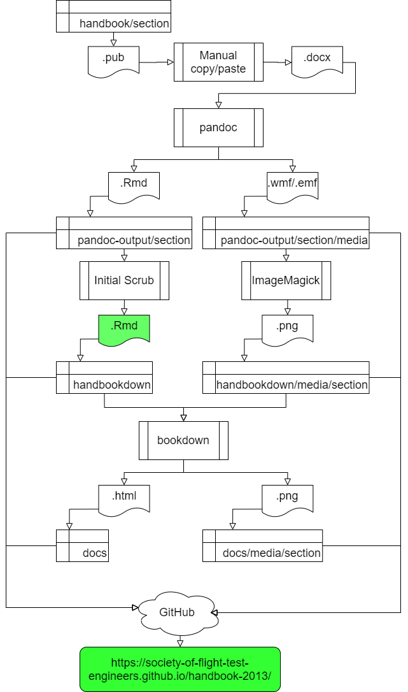

# handbook-2013

A port of the 2013 SFTE Reference Handbook to bookdown

## Join us!

Have some extra time on your hands?

Join us as a collaborator over at the SFTE GitHub handbook-2013 project!

### How to collaborate

The two primary collaboration opportunities are:

1. Proofreading the HTML website output at https://society-of-flight-test-engineers.github.io/handbook-2013/
1. Editing the Markdown text file input at https://github.com/Society-of-Flight-Test-Engineers/handbook-2013/tree/master/handbookdown

### Project organization

The project is organized around 

A. a "task board" (look for "cards" in the "To do" column) 
https://github.com/Society-of-Flight-Test-Engineers/handbook-2013/projects/1

B. an "issue list" (these are similar to a watch item or deficiency report) where issues can be 
  discussed, 
  labeled as "bugs" or "enhancements", 
  assigned to collaborators, 
  linked to task cards, 
  and much more!
https://github.com/Society-of-Flight-Test-Engineers/handbook-2013/issues

C. a "wiki" (think Wikipedia-style pages filled with our persistent, descriptive and prescriptive content )
https://github.com/Society-of-Flight-Test-Engineers/handbook-2013/wiki

### How to ask questions

Questions are best asked via an Issue by clicking the "New Issue" button on the Issue page, or clicking this link
https://github.com/Society-of-Flight-Test-Engineers/handbook-2013/issues/new

Looking forward to your contribution! 

Contributing to the modernization of the Society is a BENEFIT OF MEMBERSHIP.

## Code organization

### pandoc-output

The folder `pandoc-output` contains the raw results of converting `.docx` files to
`.md` files.

### handbookdown

The raw Pandoc output is copied to the folder `handbookdown` and edited to create a `bookdown` project.

### docs

The folder `docs` contains the HTML output of `bookdown`.

This is where <https://society-of-flight-test-engineers.github.io/handbook-2013/> is served from.

## GitHub tools being used for the project

### Project

The [Project](https://github.com/Society-of-Flight-Test-Engineers/handbook-2013/projects/1) is where tasks are created and tracked in the form of Kanban cards, most associated with [Issues](https://github.com/Society-of-Flight-Test-Engineers/handbook-2013/issues).

### Wiki

The [wiki](https://github.com/Society-of-Flight-Test-Engineers/handbook-2013/wiki) is the place for persistent discussion about the handbook

It includes the [Handbook Markdown Style Guide](https://github.com/Society-of-Flight-Test-Engineers/handbook-2013/wiki/Handbook-Markdown-Style-Guide) for contributors.

## Process Diagram

Here's a diagram of the process.

As of 2020-02-28, the coarse conversion and "initial scrub" from the source Microsoft Publisher and/or Word documents to Markdown text files (`*.Rmd`) is complete! 

## Continuous Integration/Continuous Deployment (CI/CD)

[GitHub Actions](https://github.com/features/actions) will be used to render and publish the handbook. This will allow for changes to be confirmed using a standard configuration, and for previews to be made available without having to install software on a personal device.

For more details, see the [GitHub Actions Notes](dev/gh-actions.md) file in this repo.
