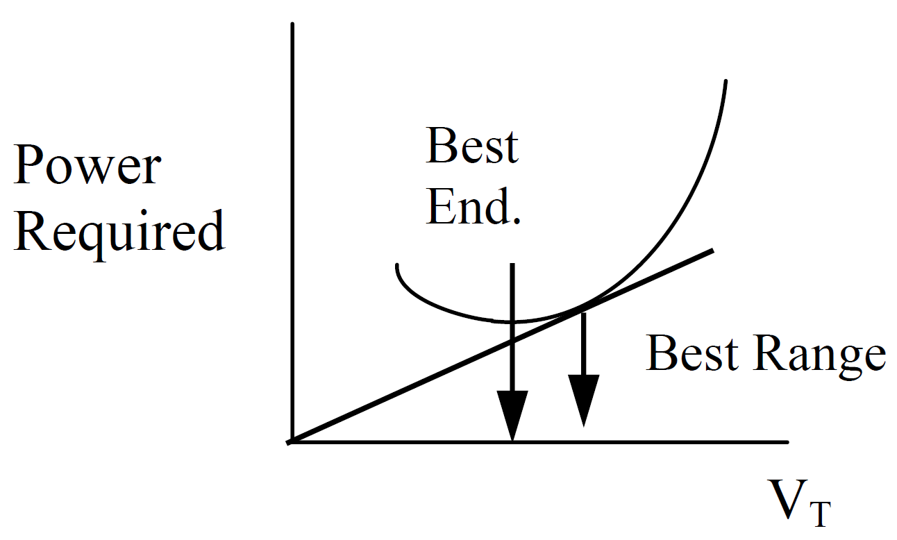
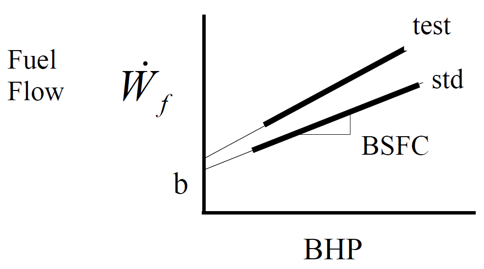
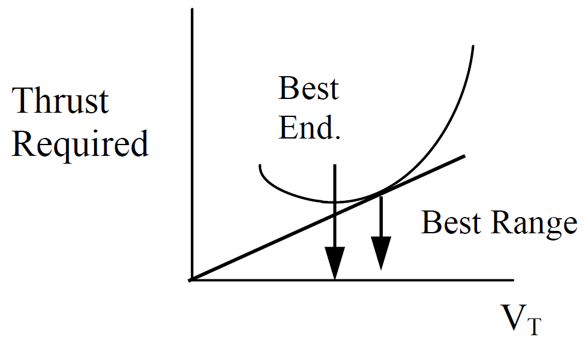
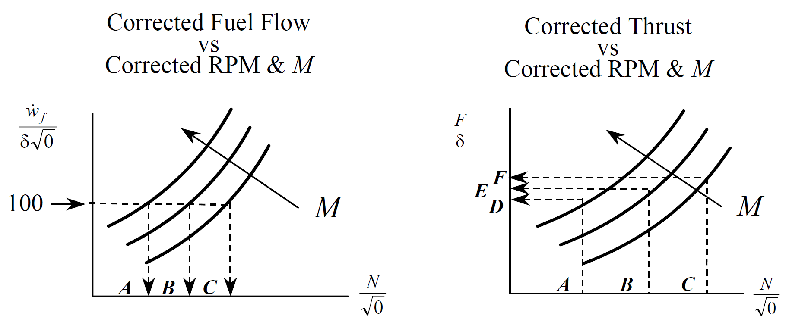
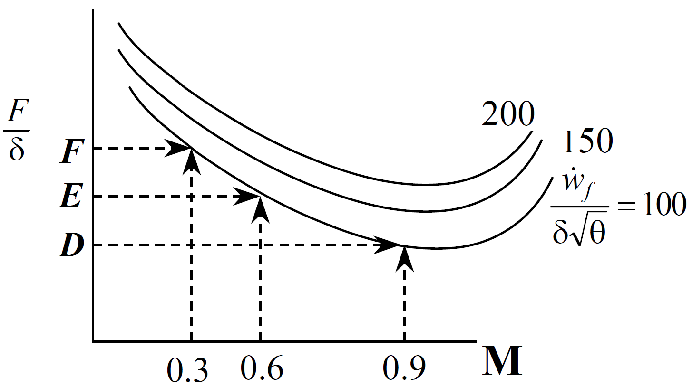
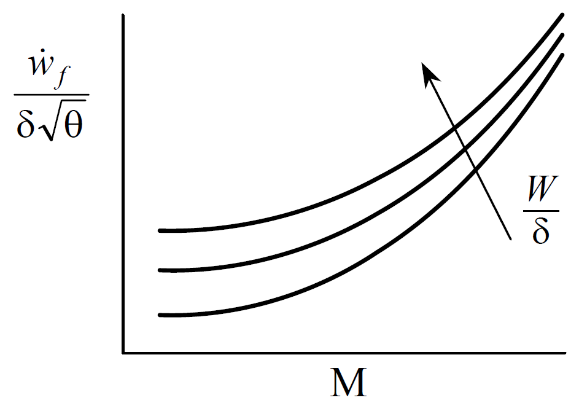

# Fixed-Wing Performance Standardization

## Recurring Abbreviations

(references 10.5.1-10.5.5)

|||
|:-|:----------|
|\(a\) |acceleration|
|\(\mathrm{BHP}\) |brake horsepower|
|\(\mathrm{BSFC}\) |brake specific fuel consumption (fuel flow per horsepower per hour)|
|\(C_D\) |drag coefficient|
|\(C_{D_i \mathrm{IGE}}\) |induced drag coefficient in ground effect|
|\(C_{D_i \mathrm{OGE}}\) |induced drag coefficient out of ground effect|
|\(C_L\) |lift coefficient|
|\(C_{L_i \mathrm{IGE}}\) |lift coefficient in ground effect|
|\(C_{L_i \mathrm{OGE}}\) |lift coefficient out of ground effect|
|\(\mathrm{cg}\) |center of gravity|
|\(D\) |drag|
|\(\frac{F}{\delta}\) |corrected thrust|
|\(F_e\) |ram thrust|
|\(F_{\text{e}}\) |excess thrust|
|\(F_g\) |gross thrust|
|\(F_n\) |net thrust|
|\(g\) |reference acceleration due to gravity \( \left( 32.174 \frac{\text{ft}}{\text{sec}^2} \right) \)|
|\(\mathrm{GE}_{C_D}\) |ground effect correction factor for drag coefficient|
|\(\mathrm{GE}_{C_L}\) |ground effect correction factor for lift coefficient|
|\(H\), \(h\) |geopotential altitude|
|\(H_c\) |pressure altitude|
|\(L\) |lift|
|\(L_W\) |lift of the wing|
|\(M\) |Mach number|
|\(m\) |mass|
|\(N_{x_w}\) |longitudinal load factor along flight path (wind axis)|
|\(N_{z_w}\), \(n_z\) |load factor normal to flight path|
|\(P\) |power output|
|\(P_0\) |standard ambient pressure sea level \( \left( 2116.22 \frac{\text{lb}}{\text{ft}^2} = 29.921 \text{ in Hg} \right) \)|
|\(P_a\) |ambient pressure|
|\(P_{iw}\) |standard day sea-level power required|
|\(P_m\) |mission-day power required|
|\(P_s\) |standard power required|
|\(P_s\) |specific excess power|
|\(P_t\) |test-day power required|
|\(q\) |dynamic pressure|
|\(R\) |range|
|\(R/C\) |rate of climb|
|\(R_n\) |Reynolds number|
|\(\mathrm{RF}\) |range factor|
|\(S\) |reference wing area|
|\(S_a\) |horizontal air distance|
|\(S_g\) |ground roll|
|\(S_{\mathrm{LD}}\) |total landing distance|
|\(S_{\mathrm{TO}}\) |total takeoff distance|
|\(\mathrm{SR}\) |specific range|
|\(T\) |ambient air temperature (absolute)|
|\(T\) |thrust|
|\(T_0\) |ambient temperature sea level standard \( \left( 288.15\text{ K} = 15.0°\text{C} \right) \)|
|\(V\) |inertial speed|
|\(V_c\) |calibrated airspeed|
|\(V_e\) |equivalent airspeed|
|\(V_{iw}\) |standard day sea-level true airspeed|
|\(V_T\) |true airspeed|
|\(V_{T_s}\) |test true airspeed|
|\(V_{T_t}\) |test true airspeed|
|\(\dot{W}_f\) |Fuel Flow|
|\(\dot{W}_{f_{iw}}\) |standard day sea-level fuel flow|
|\(W_s\) |weight standard|
|\(W_t\) |test weight|
|\(\alpha\) |angle of attack|
|\(\beta\)  |sideslip angle|
|\(\gamma\) |flightpath angle|
|\(\delta\) |ambient air pressure ratio|
|\(\iota_T\) |thrust incidence angle|
|\(\mu\) |rolling coefficient of friction|
|\(\sigma\) |ambient air density ratio|
|\(\phi\) |bank angle|
|\(\omega\)  |turn rate (rad/sec)|

## Standardization Techniques

(ref 12.5)

Performance data is usually corrected to "standard" conditions which are specified values of weight, altitude, \(\mathrm{cg}\) and Mach number. 
The process also corrects data to some standard ambient air temperature, usually defined by the \(1976\) U.S. Standard Atmosphere. 
In some cases the data is corrected to "standard hot" day or "standard cold" day conditions which are a specified increment relative to the true standard conditions.

The standardization process usually relies on models of drag, thrust (or power), fuel flow, and propeller efficiency if appropriate. 
The overall principle is to collect test data as near as practical to standard conditions \( \left( \pm 10\% \right) \) and correct the results to standard using the models. 
Even with a \(10\%\) modeling error, correcting test data that is \(10\%\) from standard leads to only \(1\%\) total error in the standardized results.

The most common of the two standardization methods is the **difference or increment method** which adds a correction to the test day parameter. 
This correction is the difference between the model predictions for standard and test conditions:

\[
P_s = P_t + \left( P_s' - P_t' \right)
(\#eq:increment)
\]

where

* \(P_s\) = standardized parameter
* \(P_t\) = test day parameter
* \(P_s'\) = standard day parameter predicted by models
* \(P_t'\) = test day parameter predicted by models

The parameter of interest can be one of the basic modeling values such as thrust, drag, power, or fuel flow.
The parameter can also be the end result of the predictive process, and may include values like takeoff/landing distance, climb/sustained turning capability, or cruise range.

The **ratio method** is the other standardization process. It corrects to standard conditions by multiplying the test values by a correction factor. 
This factor is the ratio of the model predictions for standard and test conditions.

\[
P_s = P_t  \left( \frac{P_s'}{P_t'} \right)
(\#eq:ratio)
\]

The preferred approach is whichever gives the lowest total error.
If the prediction models are in error by approximately a constant percentage, then the ratio method yields the least error.
If the models are in error by approximately a constant magnitude, then the increment method yields the least error.
Less exact empirical methods can also be used.

## Takeoff Distance

(refs 12.1, 12.2, 12.5)

The total takeoff distance, \(S_{\mathrm{TO}}\), is the sum of the ground roll distance, \(S_g\), from brake release to main wheel liftoff, and the horizontal component of the air distance, \(S_a\), from liftoff to main gear reaching either \(35\) or \(50\) feet altitude-depending on the requirements.

\[
S_{\mathrm{TO}} = S_g + S_a
(\#eq:tot-takeoff)
\]

Both \(S_g\) and \(S_a\)  can be standardized using the increment or ratio method, or by empirical relations.
The empirical methods are useful when detailed aircraft models are not available. 
The more exact process of predicting takeoff distance using models is described in section \@ref(takeoff-distance-prediction).

### Empirical Standardization Method

First correct for the effects of the test day wind. 
Define headwind velocity as \(V_w\), liftoff true airspeed as \(V_{\mathrm{LO}}\), and test day ground roll as \(S_{g_w}\).
With a typical variation of thrust per headwind, estimate the test day zero-wind ground roll, \(S_{g_{zw}}\), using the following empirical equation:

\[
S_{g_{zw}} = S_{g_w} \left( \frac{V_{\mathrm{LO}}}{V_g} \right)^{1.85}
(\#eq:zero-wind-gnd-dist)
\]

If the average thrust is not appreciably affected by velocity, then the exponent should be \(2.0\) in lieu of \(1.85\). The zero-wind air distance, \(S_{a_t}\), correction is

\[
S_{a_t} = S_{a_w} + V_w t
(\#eq:zero-wind-air-dist)
\]

where \(t\) is the time from liftoff to \(35\) (or \(50\)) feet altitude.

The second correction is for the effect of runway slope (\(\theta\), positive *uphill*) and therefore applies only to the ground roll.
Correct the above zero-wind distance, \(S_{g_{zw}}\), to the test day zero-slope distance, \(S_{g_t}\), as follows:

\[
S_{g_t} = S_{g_{zw}} \left[ 1 - \frac{W \sin \theta}{\left[ F_{\text{ex}} \right]_{\text{avg}}} \right]
(\#eq:zero-slope-air-dist)
\]

If the average excess thrust is not known, then approximate \(F_{\text{ex}}\) as that at \(70\%\) of the liftoff airspeed or from the zero-wind ground roll distance:

\[
\left[ F_{\text{ex}} \right]_{\text{avg}} \approx \frac{m V_{\mathrm{LO}^2}}{2 S_{g_{zw}}}
(\#eq:approx-fex-lo)
\]

After correcting the test day distance to zero wind and slope, use the following empirical equations to correct for non-standard weight, density, and temperature.
Any desired values can be treated as the "standard" conditions.

**Aircraft Propulsion Type and Standard Day Distance**

Fixed pitch propellers^[Neglect temp correction for constant rpm evaluation]

\begin{align} 
S_{gs} &= S_{gt} \left( \frac{W_s}{W_t} \right)^{2.4} \left( \frac{\sigma_s}{\sigma_t} \right)^{-2.4} \left( \frac{T_{as}}{T_{at}} \right)^{0.5} \\ 
S_{as} &= S_{at} \left( \frac{W_s}{W_t} \right)^{2.2} \left( \frac{\sigma_s}{\sigma_t} \right)^{-2.2} \left( \frac{T_{as}}{T_{at}} \right)^{0.6} 
\end{align}

Turbo-propeller aircraft^[For heavy aircraft, replace \(2.3\) & \(-1.2\) with \(2.6\) & \(-1.5\), respectively]

\begin{align} 
S_{gs} &= S_{gt} \left( \frac{W_s}{W_t} \right)^{2.6} \left( \frac{\sigma_s}{\sigma_t} \right)^{-1.7} \left( \frac{N_s}{N_t} \right)^{-0.7} \left( \frac{P_s}{P_t} \right)^{-0.9} \\ 
S_{gs} &= S_{gt} \left( \frac{W_s}{W_t} \right)^{2.3} \left( \frac{\sigma_s}{\sigma_t} \right)^{-1.2} \left( \frac{N_s}{N_t} \right)^{-0.8} \left( \frac{P_s}{P_t} \right)^{-1.1} 
\end{align}

Large jet aircraft^[For light jets, replace \(2.3\) & \(-0.7\) with \(2.6\) & \(-1.0\), respectively]

\begin{align} 
S_{gs} &= S_{gt} \left( \frac{W_s}{W_t} \right)^{2.3} \left( \frac{\sigma_s}{\sigma_t} \right)^{-1.0} \left( \frac{F_{ns}}{F_{nt}} \right)^{-1.3}  \\ 
S_{gs} &= S_{gt} \left( \frac{W_s}{W_t} \right)^{2.3} \left( \frac{\sigma_s}{\sigma_t} \right)^{-0.7} \left( \frac{F_{ns}}{F_{nt}} \right)^{-1.6} 
\end{align}

where

* \(P_t\) = Test day brake power at the propeller
* \(P_s\) = Standard day brake power at the propeller
* \(N_t\) = Test day propeller \(\text{RPM}\)
* \(N_s\) = Standard day propeller \(\text{RPM}\)
* \(F_{nt}\) = \(T_{at}\) = Average test net thrust (approx \(0.94 \times \)static thrust @ test conditions)
* \(F_{ns}\) = \(T_{as}\) = Average standard net thrust (approx \(0.94 \times \)static thrust @ standard conditions)

### Takeoff Distance Prediction

(refs 12.1, 12.5)

**Estimating takeoff ground roll without numerical methods**

Define

* \(V\) = airspeed
* \(V_{\mathrm{TO}}\) = liftoff airspeed
* \(S_g\) = ground roll distance
* \(S_w\) = reference wing area
* \(F_{\text{ex}}\) = excess thrust
* \(F_n\) = net thrust
* \(C_{L_{\mathrm{IGE}}}\) = lift coefficient in ground effect
* \(C_{D_{\mathrm{IGE}}}\) = drag coefficient in ground effect
* \(W\) = aircraft weight
* \(m\) = rolling friction
* \(g\) = acceleration due to gravity
* \(A\) = acceleration = g\*Fex/

Assuming zero initial speed for takeoff run, ground roll distance

\[
S_g = \frac{V_{\mathrm{TO}}^2 \cdot W}
{2 \cdot g \cdot 
  \left( 
        T_{\text{avg}} 
        - \mu \cdot W 
        + \frac{1}{6} \cdot \rho \cdot S_w \cdot V_{\mathrm{TO}}^2 \cdot 
        \left( \mu \cdot C_{L_{\mathrm{IGE}}} 
              - C_{D_{\mathrm{IGE}}} 
        \right) 
  \right)
}
(\#eq:gnd-roll-dist-to)
\]

Where 

* \(F_{n_{\text{avg}}}\) may be estimated as the average of static thrust and net thrust at liftoff airspeed. If the initial airspeed is non-zero, its value should be inserted into Equation \@ref(eq:zero-wind-gnd-dist) in place of \(V_{\mathrm{LO}}\) and the answer subtracted from the zero-wind case.
* \(\mu\) is the rolling friction coefficient (typically between \(0.015\) and \(0.025\) for hard dry runways), and
* \(C_{L_{\mathrm{IGE}}}\) is the lift coefficient in ground effect while at ground roll attitude.

Estimate \(C_{L_{\mathrm{IGE}}}\) by determining the out-of-ground-effect lift coefficient, \(C_{L_{\mathrm{OGE}}}\), at the ground roll angle of attack and correcting it as follows:

\[
C_{L_{\mathrm{IGE}}} = C_{L_{\mathrm{OGE}}} \mathrm{GE}_{C_L}
(\#eq:est-c-l-ige)
\]

where

* the ground effect factor, \(\mathrm{GE}_{C_L} = 0.8609 - 0.6282 \log_{10} \left( \frac{h}{b} \right) \) and 
* \(h\) is the wing height above the surface and 
* \(b\) is the wingspan. 

The above correction is *not used* above the height that predicts

\[
\mathrm{GE}_{C_L}  <  1
\]

\(C_{D_{\mathrm{IGE}}}\) is the induced drag coefficient while in ground effect. Estimate this by determining the out-of-ground-effect drag coefficient, \(C_{D_{\mathrm{OGE}}}\), at the appropriate angle of attack and correcting it as follows:

\[
C_{D_{\mathrm{IGE}}} = C_{D_{\mathrm{OGE}}} \mathrm{GE}_{C_D}
(\#eq:est-c-d-ige)
\]
 
where the ground effect factor, \(\mathrm{GE}_{C_D} = 0.2412 \ln \left( \frac{h}{b} \right) + 1.0829 \) 

The above correction is *not used* above the height that predicts

\[
\mathrm{GE}_{C_D}  >  1
\]

A **direct approximation of takeoff air distance** requires the desired speeds at liftoff and at 50 feet (typically \(1.1 V_s\) and \(1.2 V_s\), respectively).
It also requires an estimate of the average excess thrust as the aircraft climbs out of ground effect.

\[
S_a = \frac{W}{\left( T - D \right)_{\text{avg}}} \left[ \frac{V_{50}^2 - V_{\mathrm{LO}}^2}{2g} + 50 \right]
(\#eq:direct-to-air)
\]

A **direct approximation of the total takeoff distance**, \(S_{\mathrm{TO}}\) can be calculated as the sum of the ground and air distances or can be estimated by multiplying the ground roll distance by a "planform factor," \(F_{\text{pl}}\).

\[
S_{\mathrm{TO}} = S_g F_{\text{pl}}
(\#eq:s-to-fpl-approx)
\]

\(F_{\text{pl}}\) combines the effects of wing type, thrust-to-weight ratio, and pilot technique.
The following values characterize the typical aircraft.

* straight wing: \(F_{\text{pl}} = 1.15\)
* swept wing: \(F_{\text{pl}} = 1.36\)
* delta wing: \(F_{\text{pl}} = 1.58\)

A more **exact prediction of takeoff performance** (ref 12.5) requires accurate thrust and drag models and an integration of the aircraft's velocity over the takeoff time.
This is equivalent to a double integration of the aircraft's acceleration or its specific excess thrust.

\[
S_{\mathrm{TO}} = \int V_T \mathop{dt} = \iint a \mathop{dt} = \iint \frac{F_{\text{ex}}}{m} \mathop{dt} = \frac{1}{m} \iint F_{\text{ex}} \mathop{dt}
(\#eq:s-to-fpl-exact)
\]

This double integration can be performed numerically or graphically.
Alternately, use planar kinematics and sum the distances required to accelerate between incremental true airspeeds from brake release, \(V_0\), to the true airspeed when the aircraft reaches the takeoff altitude, \(V_{50'}\).

\[
S_{\mathrm{TO}} = \frac{m}{2} \sum_{V_0}^{V_{50'}} \frac{V_2^2 - V_1^2}{F_{\text{ex}}}
(\#eq:to-dist)
\]

Both methods above are typically split into pre-rotation ground roll, rotation/post-rotation ground roll, and airborne segments.
Both methods require calculation of the excess thrust, addressed below.

Solving for the excess net thrust *during the ground roll* for either takeoff or landing cases requires a simultaneous solution of the three equations of motion along the aircraft's longitudinal & vertical axes and about the pitch axis.
These equations (in the above order) are as follows:

\[
F_{\text{ex}}+ \mu_{\text{nw}} R_{\text{nw}} + \mu_m R_m = F_g \cos \iota_T + F_e - D_{\text{wb}} - D_t - W \sin \theta_{\text{rw}}
(\#eq:eom-x)
\]

\[
R_{\text{nw}} + R_m = W \cos \theta_{\text{rw}} - L_w - L_t
(\#eq:eom-z)
\]

\[
\begin{split}
\left( X_1 + X_2 \right) R_{\text{nw}} = W& \cos \theta_{\text{rw}} X_2 \\
&+ W \sin \theta_{\text{rw}} Z_1 \\
&+ \left( F_g \cos \left( \theta + \iota_T \right) - F_e \right) Z_1 \\
&+ L_t \left( X_3 + X_4 - X_2 \right) \\&- L_w \left( X_2 - X_3 \right) \\
&- D_t \left( Z_1 + Z_2 \right)
\end{split}
(\#eq:eom-pitch)
\]

where

* \(F_{\text{e}}\) = excess net thrust
* \(\mu_{\text{nw}}\) = nose wheel coefficient of friction (about \(0.02\) for takeoff, \(0.50\) for maximum dry runway braking)
* \(R_{\text{nw}}\) = reaction force (weight) on nose wheel (positive)
* \(\mu_m\) = main wheel coefficient of friction (positive)
* \(R_m\) = reaction force (weight) on main wheel (positive)
* \(F_g\) = gross engine thrust (positive, aligned with engine axis)
* \(\iota_T\) = thrust incidence angle (positive denotes thrust that generates lift)
* \(F_e\) = ram thrust (or drag) due to momentum change of the air outside the engine, measured along drag axis- aligned with relative wind (typically negative at low speed, positive at high speed)
* \(D_{\text{wb}}\) = aerodynamic drag of wing and body (excludes horizontal tail drag)
* \(D_t\) = aerodynamic drag of horizontal tail (positive aft)
* \(W\) = aircraft weight (positive)
* \(\theta_{\text{rw}}\) = runway slope (positive denotes uphill)
* \(L_w\) = main wing lift (positive denotes up)
* \(L_t\) = horizontal tail (positive denotes up)
* \(X_1\) = distance from nose gear to aircraft cg (positive)
* \(X_2\) = distance from the main gear to aircraft cg (positive)
* \(Z_1\) = distance from the ground plane to the aircraft body axis (positive)
* \(\theta\) = aircraft pitch attitude (positive denotes nose up)
* \(X_3\) = horizontal distance from the wing's aerodynamic center to aircraft \(\mathrm{cg}\) (positive)
* \(X_4\) = horizontal distance from the wing's aerodynamic center to the horizontal tail's aerodynamic center (positive)
* \(Z_2\) = vertical distance from the horizontal tail's aerodynamic center to the aircraft body axis (positive)

The previous equations were arranged so that the right hand side of each can be abbreviated as \(A_1\), \(A_2\), and \(A_3\) respectively.
This step allows for a compact matrix form of the equations using a \(3 \times 3\) matrix.

\[
\begin{bmatrix}
1 & \mu_{\text{mw}} & \mu_m \\
0 & 1 & 1 \\
0 & X_1 + X_2 & 0
\end{bmatrix}
\begin{bmatrix}
F_{\text{ex}} \\
R_{\text{mw}} \\
R_m
\end{bmatrix}
=
\begin{bmatrix}
A_1 \\
A_2 \\
A_3
\end{bmatrix}
\]

Solve for \(F_{\text{ex}}\) by pre-multiplying both sides by the inverse of the first matrix.

\[
\begin{bmatrix}
F_{\text{ex}} \\
R_{\text{mw}} \\
R_m
\end{bmatrix}
=
\begin{bmatrix}
1 & \mu_{\text{mw}} & \mu_m \\
0 & 1 & 1 \\
0 & X_1 + X_2 & 0
\end{bmatrix}^{-1}
\begin{bmatrix}
A_1 \\
A_2 \\
A_3
\end{bmatrix}
\]

Although wheel reaction forces are not required for takeoff distance prediction, they are useful for accurate calculation of rotation capability and for braking effectiveness during landing ground rolls.
For takeoff calculations, several simplifying assumptions can be made such as:

\begin{align}
\mu_{\text{nw}} &= \mu_m = 0.02 \\
F_g &\gg F_e \\
D_t &= 0
\end{align}

This above approach can be repeated for the segment between rotation and liftoff.
This is slightly more complicated because the changing angle of attack alters drag and acceleration.

Precise **predictions of the takeoff air distance** can be made by applying Equation \@ref(eq:direct-to-air) in small increments using accurate models that describe thrust as a function of airspeed and the lift & drag changes due to climbing out of ground effect.

Along with the incremental \(S_g\) and \(S_a\) calculations, the time to accelerate between the corresponding incremental velocities can be calculated as

\[
\Delta t = m \frac{V_2 - V_1}{F_{\text{ex}}}
\]

## Landing Distance

(refs 12.1, 12.2)

The total landing distance, \(S_{\mathrm{LD}}\), is the sum of the ground roll distance (\(S_g\), from touchdown to full stop) and the horizontal component of the air distance (\(S_a\), from the screen height to touchdown).
The screen height can be either \(35\) or \(50\) feet above the surface, depending on the requirements

\[
S_{\mathrm{LD}} = S_g + S_a
\]

Both \(S_g\) and \(S_a\) can be standardized according to the increment or ratio methods described by Equations \@ref(eq:increment) and \@ref(eq:ratio), or by empirical relations.
The empirical methods are useful when detailed aircraft models are not available.
The more exact process of predicting landing distance using models is described in section 12.4.2.

### Empirical Standardization Method

First correct for the effects of the test day wind.
Define headwind velocity as \(V_w\), touchdown true airspeed as \(V_{\mathrm{TD}}\), and test day ground roll as \(S_{g_w}\).
With a typical variation of thrust per headwind, estimate the test day zero-wind ground roll, \(S_{g_{zw}}\), using the approach applied to takeoff ground roll:

\[
S_{g_{zw}} = S_{g_w} \left( \frac{V_{\mathrm{LO}}}{V_g} \right)^{1.85}
(\#eq:emp-zero-wind-gnd-roll-dist-land)
\]

If the average thrust is not appreciably affected by velocity, then the exponent should be \(2.0\) in lieu of \(1.85\).

Apply Equation \@ref(eq:zero-wind-air-dist) to correct to the zero-wind air distance (where \(t\) is the time to descend from the screen height to touchdown).

To **correct to a zero-slope runway**, apply Equation \@ref(eq:zero-slope-air-dist) to the zero-wind ground roll distance (note that \(F_{\text{ex}}\) is negative).
If the average excess thrust is not known, then approximate \( \left[ F_{\text{ex}} \right]_{\text{avg}} \) as that at \(70\%\) of the touchdown airspeed.
Alternately, approximate \( \left[ F_{\text{ex}} \right]_{\text{avg}} \)  from the zero-wind ground roll distance using

\[
\left[ F_{\text{ex}} \right]_{\text{avg}} \approx \frac{m V_{\mathrm{TD}}^2}{2 S_{g_{zw}}}
(\#eq:approx-fex-td-land)
\]

After correcting the test day distance to zero wind and slope, use the following empirical equations to correct the ground roll to standard weight and air density.

\[
S_{g_s} = S_{g_t} \left[ \frac{Ws}{Wt} \right]^2 \frac{\sigma_t}{\sigma_s}
(\#eq:std-gnd-roll-dist-land)
\]

Any desired values can be treated as the "standard" conditions.

Correct the air distance to standard weight and air density using the zero-wind air distance as follows (for a \(50\)-foot screen height)

\[
S_{a_s} = S_{a_t} \left[ \frac{Ws}{Wt} \right]^{2 + \frac{h_v}{h_v + 50}} \left[ \frac{\sigma_t}{\sigma_s} \right]^{2 + \frac{h_v}{h_v + 50}}
(\#eq:std-air-dist-land)
\]

where \(h_v\) is the specific kinetic energy change during the air phase.
For the case of a \(50\text{-foot}\) screen height, this term is calculated as

\[
h_v = \frac{V_{50'}^2 - V_{\mathrm{TD}}^2}{2g}
(\#eq:spec-ke-chg)
\]

### Landing Distance Prediction

With reasonably precise models available, the landing distance can be predicted 
through calculation. Test distances can then be standardized using either the 
increment or ratio method, Equations \@ref(eq:increment) and \@ref(eq:ratio).

A **direct approximation of landing ground roll** can be obtained by applying the 
same equation used for the takeoff case, Equation \@ref(eq:gnd-roll-dist-to). This method requires a value for 
the average net thrust, \(T_{\text{avg}}\) across the landing roll speed range and 
reasonable values for the wheel braking friction coefficient, 
\( 0.35  <  \mu  <  0.50 \) for typical dry runway max braking. The same equations 
for estimating ground effect also apply.

A **direct approximation of takeoff air distance** including the flare requires 
the desired lift and associated drag coefficients, the thrust, and the applied 
normal load factor during the landing flare, \( n = 1.15 \).

\[
S_a = \frac{50}{\left( \frac{C_D}{C_L} - \frac{T}{W} \right)} + \frac{ \frac{W}{S} \left( \frac{C_D}{C_L} \frac{T}{W} \right) }{T \rho_0  g \left( n - 1 \right) C_L }
(\#eq:approx-air-dist-land)
\]

A more **exact prediction of landing performance** requires accurate thrust and 
drag models and an integration of the aircraft's velocity across the landing 
time. This is equivalent to a double integration of the aircraft's acceleration 
as shown in Equation \@ref(eq:s-to-fpl-exact). This double integration can be performed
numerically or graphically. Similarly, Equation \@ref(eq:to-dist) can be adapted 
for landing as follows:

\[
S_{\mathrm{LD}} = \frac{m}{2} \sum_{V_0}^{V_{50'}} \frac{V^2_2 - V^2_1}{F_{\text{ex}}}
(\#eq:land-dist)
\]

As with the takeoff case, this equation is usually broken into the air phase and 
the ground roll phase. Calculation of excess thrust during the ground roll needs 
to consider the changing weight on the wheels and associated braking force. This 
requires a simultaneous solution of the three equations of motion along the 
aircraft's longitudinal & vertical axes and about the pitch axis, previously 
shown as Equations \@ref(eq:eom-x), \@ref(eq:eom-z), and \@ref(eq:eom-pitch).

Precise calculation of excess thrust during the air phase must consider the 
change in normal and longitudinal load factor during the flare and the changes 
in lift and drag coefficients due to entering ground effect (previously 
described).

If the desired flare technique is some schedule of flight path angle, 
\(\gamma\), versus altitude, then the normal load factor can be calculated from 
\(\gamma\) and the rate of \(\gamma\) using

\[
N_z = \cos \gamma + \frac{\dot{\gamma} V_T}{g}
\]

The longitudinal load factor can be calculated as

\[
N_x = \frac{\dot{H}}{V_T} + \frac{\dot{V_T}}{g}
\]

where

\[
\sin \gamma = \frac{\dot{H}}{V_T}
\]

An alternate method of calculating distance is the **fixed time increment approach**. 
The following air distance example is based on a *constant angle of attack* 
landing technique (ref 12.5).

| Fixed inputs | Initial inputs |
|:-----------------|:-----------|
| angle of attack, \(\alpha\) | initial ground speed, \( V_{g_0} \) |
| wing area, \(S\) | initial air distance, \( S_{a_0} = 0 \) |
|air density, \(\rho\) | initial altitude, \( h_0 \) |
|weight, \(W\) | initial sink rate, \( \dot{h}_0 \) |
|wingspan, \(b\) | initial lift coefficient, \( C_{\mathrm{LOGE}} \)|
|head wind, \( V_w \) | wing aspect ratio, \(\mathrm{AR}\) |
|net thrust, \( F_n \left( F_n = F_g \cos \alpha - F_e \right) \) | wing Oswald efficiency factor, \(e\) |
|time increment, \(\Delta t \) (\(0.05 \text{ sec} \) works well) | |
|height of wing above ground when on gear, \(h_{\text{wing}}\) | |

| Initial calculations |
|-|
| initial true airspeed, \(V_{T_0} = V_{g_0} + V_w \) |
| initial glide slope, \( \gamma_0 = \sin^{-1} \frac{ \dot{h}_0 }{V_{T_0}} \) |
| initial load factor, \( N_z = \cos \gamma_0 \) (assumes \( \frac{d \gamma_0}{dt} = 0  \)) |
| initial trim speed, \( V_T =\left[ \frac{2 N_z W}{\rho C_L S} \right]^{\frac{1}{2} } \) |

[Incremental calculations]{.underline}

(values with prime symbols represent the result of the previous iteration)

1. \(C_L = C_{\mathrm{LOGE}} \mathrm{GE}_{\mathrm{CL}} = C_{\mathrm{LOGE}} \left[0.8609 - 0.6282 \log_{10} \left( \frac{h}{b} \right) \right] \)
2. \(L = 0.5 N_z W \rho C_L S V_T^2 \)
3. \(N_z = \frac{L}{W} \)
4. \(\dot{\gamma} = \frac{g \left(N_z - \cos \gamma \right)}{V_T} \)
5. \(\gamma = \dot{\gamma}' \Delta t + \gamma' \)
6. \(\dot{h} = V_T \sin \gamma \)
7. \(h = \left( \dot{h} + \dot{h}' \right) \frac{\Delta t}{2} + h' \)
8. \(C_{D_i \mathrm{IGE}} = C_{D_i \mathrm{OGE}} \mathrm{GE}{C_D} = \left[ \frac{C_L^2}{\pi \mathrm{AR} e} \right] \left[0.2412 \ln \left( \frac{h}{b} \right) + 1.0829 \right] \)
9. \(C_D = C_{D_0} + C_{D_i \mathrm{IGE}}\)
10. drag, \( D = \frac{C_D \rho S V_T^2}{2} \)
11. \( F_{\text{ex}} = F_n - D \)
12. \(N_x = \frac{F_{\text{ex}}}{W} \)
13. \(\dot{V} = g \left( N_x - \sin \gamma \right) \)
14. \(V_g = V_g' + \dot{V} \Delta t \)
15. \(S_a = \left(V_g + V_g' \right) \frac{\Delta t}{2} + S_a' \)

## Climb/Descent/Level Acceleration

(ref 12.4)

Standard performance can be determined either by *predicting* results using 
(flight test validated) models or by *correcting* individual flight test 
climb/acceleration results to standard conditions.

Performance predictions require accurate net thrust and aerodynamic models. Net 
thrust is the sum of the gross thrust and ram drag, while the aero model 
includes the drag polar and lift curve.

Corrections to individual climb/accelerations tests require models that only 
show the *change* in thrust & drag between test and standard conditions. The 
following sections address both the prediction and correction approaches.

### Climb/Descent/Acceleration Prediction

According to basic energy theory, an aircraft's specific excess power, \(P_s\),
is related to the change in kinetic and potential energy as follows:

\[
P_s = \frac{P_{\text{ex}}}{W} = \frac{\left( F_n - D \right) V}{W} = \frac{dH}{dt} + \frac{H}{W} \frac{d W}{dt} + \frac{V}{g}\frac{dV}{dt} + \frac{V^2}{2Wg} \frac{dW}{dt}
(\#eq:p-sub-s)
\]

where \(V\) is technically inertial speed. True airspeed and an assumption of 
zero wind is usually used instead of inertial speed. Since aircraft typically 
have negligible weight change during a maneuver, the above reduces to:

\[
P_s = \frac{\left( F_n - D \right) V}{W} = \frac{dH}{dt} + \frac{V}{g}\frac{dV}{dt}
(\#eq:p-sub-s-redux)
\]

This shows not only how climb rate *or* acceleration performance can be 
predicted, but also shows how the climb and acceleration capabilities can be 
*exchanged* at any given specific excess power. Dividing this equation through 
by \(V\) shows the relation between specific excess thrust and **climb angle**, 
**\(\gamma\)**.

\[
\frac{P_s}{V} = {F_n - D}{W} = \frac{\dot{H}}{V} + \frac{1}{g} \frac{dV}{dt} = \sin \gamma
(\#eq:p-sub-s-over-v)
\]

When predicting climb performance capability using this approach, iterations may 
be required because the resulting climb angle affects the normal load factor,
\( N_z = \cos \gamma \), and therefore the induced drag.

### Correcting to Standard Climb Rate

*The below sequence corrects results at the test q and (usually) pressure altitude*

*(i.e. \(V_{e_{\text{test}}} = V_{e_{\text{std}}} \), and \( H_{\text{test}} = H_{\text{std}} \))*

1. If the test day vertical velocity is measured by timing pressure altitude 
changes, then first correct the altimeter readings for instrument error and 
then convert the indicated pressure altitude rate to geometric (tapeline) climb 
rate as follows

\[
\left. \frac{dH}{dt} \right|_t = \left( \frac{T_t}{T_s} \right) \left. \frac{dH}{dt} \right|_{\text{indicated}} 
\]

2. Equation \@ref(eq:p-sub-s-redux) yields the climb rate correction that 
accounts for the change in power (or thrust) between test and standard days 
(at the test weight and velocity)

\[
\left. \Delta \dot{H} \right|_P = \Delta P_s = \frac{\Delta P}{W} = \frac{\Delta F_n V}{W}
\]

where \(\Delta P\) or \(\Delta F_n\) comes from engine models. For reciprocating 
engines without models that can predict this power change, estimate the 
correction using only a standard day power chart and the following equation

\[
\left. \Delta \dot{H} \right|_P = \frac{500 \eta B H P_s}{W_t} \left[ 1 - \sqrt{\frac{T_s}{T_t} } \right] = \frac{\Delta F_n V}{W}
\]

3. A changing horizontal headwind with altitude will alter climb results. If 
this change, \( \frac{d V_w}{dH} \) is known, then add the following 
correction to the tapeline climb rate

\[
\left. \Delta \dot{H} \right|_{\text{hw}} = \frac{V}{g} \left( \frac{dV}{dH} \right) \left( \frac{dH}{dt} \right)_s 
\]

Usually the exact wind shear profile is unknown. In this case, fly perpendicular
to the known crosswind direction and repeat each climb speed at the reciprocal 
heading. After completing the remaining corrections listed below, average the 
reciprocal results to obtain a standard climb rate.

4. If the climb is flown at constant indicated airspeed or Mach, then true 
airspeed will change with air density. Correct for any change in true airspeed 
with the following "acceleration factor" correction

\[
\left. \Delta \dot{H} \right|_{\text{AF}} = \frac{V}{g} \frac{dV}{dt} = \frac{V}{g} \left( \frac{V_{\text{final}} - V_{\text{initial}}}{\text{time to climb}} \right)
\]

5. Combine the previous corrections then multiply this by the "inertial 
correction" factor that accounts for the inertial effects of changing the 
weight from test to standard conditions

\[
\left. \dot{H} \right|_I = \frac{W_t}{W_s}
\]

6. To the above result, add a correction for the change in induced drag due to 
weight change.

\[
\left. \dot{H} \right|_{\text{Ind}} = \frac{2}{\pi \mathrm{AR} e \rho_{\text{alt}} V_T S} \left[ \frac{W_t^2 - W_s^2}{W_s} \right]
\]

**Summary of climb rate corrections**

\[
\left. \dot{H} \right|_{\text{std}} = 
\left\{
      \left( \frac{T_t}{T_s}  \right)
      \left. \frac{dH}{dt} \right|_{\text{indicated}} +
      \left. \Delta \dot{H} \right|_P + 
      \left. \Delta \dot{H} \right|_{\text{hw}} +
      \left. \Delta \dot{H} \right|_{\text{AF}}   
\right\}
\left. \dot{H} \right|_I + 
\Delta \left. \dot{H} \right|_{\text{Ind}}
(\#eq:climb-rate-corr)
\]

Equation \@ref(eq:climb-rate-corr) can also be used to correct descents, level accelerations, and level decelerations to a standard climb rate. The primary difference is that for level accelerations, the accelerations factor is the dominant term while the indicated climb rate is near zero.

### Weight/Altitude/Temperature (WAT) Limits

To ensure safety, aviation authorities specify minimum climb gradients,
\(\gamma_{\text{req'd}} \), for many aircraft operations. The most straight 
forward way to comply with the specified gradients is to document the maximum 
allowable weight at various pressure altitude/temperature combinations.

Assuming the test day \(C_L\) for best \(\gamma\) equals that for any other day,
calculate the maximum allowable weight by applying the following correction to 
the best test \(\gamma\) results.

\[
W_{\text{max}} = \frac{ \left[  \sin \gamma_t + \frac{C_{D_0}}{C_L} + \frac{C_L}{\pi \mathrm{AR} e} \right] W_t + \Delta F_n}{ \sin \gamma_{\text{req'd}} + \frac{C_{D_0}}{C_L} + \frac{C_L}{\pi \mathrm{AR} e}  }
\]

where \( \Delta F_n = F_{n_{\text{std}}} - F_{n_{\text{test}}} \) comes from the 
engine model. To ensure accuracy, the test configuration (i.e., one engine 
inoperative) must equal the standard configuration. Level acceleration results 
are not an acceptable substitute for actual climb data. 

## Level Turn Performance

(ref 12.1)

Standard level turn performance can be determined either by *predicting* results 
using (flight test validated) models or by *correcting* individual turn results 
to standard conditions. It is possible to predict turn performance using climb 
or level acceleration data, but this approach is not always accurate and should 
be validated with actual turn results.

Performance predictions require accurate net thrust and aero models (drag polar 
and lift curve). Corrections to test day turn results require models that only 
show the *change* in thrust & drag between test and standard conditions.

The following sections address both the prediction and correction approaches. 
For either approach, load factor, \(n_{\text{zw}} \), is usually determined first, 
then the corresponding turn rate, \(\omega \left[ \frac{\text{radians}}{\text{sec}} \right] \), 
and radius, \(R \left[ \text{ft} \right] \), are calculated using the equations 
below.

\begin{align}
R &= \frac{V_T^2}{g \sqrt{n_{\text{zw}}^2 - 1}} \\
\\
\omega &= \frac{g \sqrt{n_{\text{zw}}^2 - 1}}{V_T} \\
\\
n_{\text{zw}} &= \sqrt{ \left( \frac{\omega V}{g} \right)^2 + 1  } \\
(\#eq:r-omega-n-zw)
\end{align}

### Sustained Level Turn Performance Prediction

1. At the desired speed, altitude, temperature, and throttle setting use the
engine model to determine the gross thrust, \(F_g\). Sophisticated models may 
show this to be a function of the inlet angle of attack as well.

2. At the same conditions, use the engine and airframe models to determine the 
ram drag, \(F_e\).

3. Calculate net thrust as \(F_n = F_g \cos \alpha_F + F_e\) where 
\(\alpha_F = \left(\alpha + \iota_T \right) \) and \(\iota_T\) is the incidence angle of 
the thrust line (TED positive).

4. The total lift is the sum of the wing lift and the thrust lift:

\[
L = L_W + F_g \sin \alpha_F
\]

Since \(L = n_{\text{zw}} W \), then \(L_W = n_{\text{zw}} W - F_g \sin \alpha_F\)

5. For any sustained turn, the net thrust equals the drag

\[
F_n = D = qSC_D = 
qS \left[ 
      C_{D_0} + 
      \frac{\left( \frac{L_W}{qS} \right)^2}{\pi \mathrm{AR}e} 
   \right] =
qS \left[
      C_{D_0} + 
      \frac{\left( n_{\text{zw}} W - F_g \sin \alpha_F \right)^2}
           {\left(qS\right)^2 \pi \mathrm{AR}e} 
   \right]
\]

Solving for load factor gives

\[
n_{\text{zw}} = \frac{1}{W}
      \left(
            \left\{
                  \left[
                        \frac{F_g \cos \left(\alpha + \iota_T \right)+F_e}
                             {qS} -
                        C_{D_0}
                  \right]
                  \left(
                        qS
                  \right)^2
                  \pi \mathrm{AR} e
            \right\}^{\frac{1}{2}} +
            F_g \sin \left(\alpha + \iota_T \right)
      \right)
(\#eq:load-factor-sus-turn)
\]

For any combination of weight, altitude, and airspeed, calculation of the 
standard sustained load factor requires knowledge of the gross thrust, ram 
drag, drag polar (\(C_{D_0},\,e\)), and angle of attack.

6. To determine the standard angle of attack, start with the lift curve slope 
model

\[
C_L = C_{L_{\alpha = 0}} + \frac{dC_L}{d\alpha} \alpha = C_{L_{\alpha = 0}} + C_{L_{\alpha}}\alpha
\]

Rearrange to solve for \(\alpha\)

\[
\alpha = \frac{C_L - C_{L_{\alpha = 0}}}{C_{L_{\alpha}}} =
      \frac{\left(
                  \frac{n_{\text{zw}}W - F_g \sin \left(\alpha + \iota_T \right)}
                       {qS}
            \right)^2 - C_{L_{\alpha = 0}}}
           {C_{L_{\alpha}}}
(\#eq:alpha-std)
\]

Because \(\alpha\) cannot be solved for explicitly, calculate it using 
successive iterations of Equations \@ref(eq:load-factor-sus-turn) and \@ref(eq:alpha-std).

In cases where

\[
\frac{F_g}{W} \sin \alpha_F  <  \frac{n_{\text{zw}}}{10}
\]

the angle of attack can be roughly estimated without significant error to the 
final result.

### Sustained Level Turn Performance Correction

The best method for obtaining standardized sustained level turn data is to 
correct actual level turn results to standard conditions. It is also possible 
to correct level acceleration or climb data to give standard level turn results. 
This approach may not work as well since any drag polar or engine model errors 
will be magnified. Additionally, inlet distortion that accompanies actual turn 
thrust is different during (low angle of attack) climbs and accelerations.

The equation below corrects any combination of test day climb, turn, and 
acceleration to a load factor for a sustained turn at the same dynamic pressure 
but at standard conditions.

\begin{align}
n_{\text{zw}_{\text{std}}} = \frac{F_{g_{\text{std}}}}{W_s} \sin \alpha_{F_s} + 
\left\{ 
      \left(
            n_{\text{zw}_t} \frac{W_t}{W_s} -
            \frac{F_{g_t}}{W_s} \sin \alpha_{F_t}
      \right)^2 + 
      \frac{\pi \mathrm{AR}eqS}{W_s^2}
      \left[
            \frac{W_t \dot{V}_{T_t}}{g} + 
            \frac{W_t \dot{H}_t}{V_{T_t}} + 
            F_{g_{\text{std}}} \cos \alpha_{F_{\text{std}}} -
            F_{g_t} \cos \alpha_{F_t}
      \right]
\right\}^{\frac{1}{2}}
(\#eq:load-factor-corr)
\end{align}

then the above equation can be closely approximated as

\[
\text{If } \frac{F_g}{W} \sin \alpha_F  <  \frac{n_{\text{zw}}}{10}
\]

\[
n_{\text{zw}_{\text{std}}} = \frac{1}{W_S}
\sqrt{ 
      \left(
            n_{\text{zw}_t} W_t 
      \right)^2 + \pi \mathrm{AR}eqS 
      \left[
            \frac{\dot{V}_{T_t} W_t}{g} +
            \frac{\dot{H}_t W_t}{V_T} +
            \Delta F_{\text{ex}}
      \right]
 }
(\#eq:load-factor-std)
\]

where \( \Delta F_{\text{ex}} = F_{g_{\text{std}}} \cos \left( \alpha_{F_{\text{std}}} \right) - F_{g_t} \cos \left( \alpha_{F_t} \right) \)

The primary difference between using turn, accel, or climb test data is the 
dominant term in the above corrections. In all cases, the test and standard day 
thrust values come from engine models.

### Level Limit Turn Performance Correction

A limit turn is one in which the aircraft performs a level turn beginning from 
maximum speed and maximum load factor and continues to decelerate at the 
\( N_{z_b} \) limit until reaching the maximum \(C_L\). At this point, the 
aircraft continues its level turning deceleration at the lift limit. This 
maneuver is also known as a "slow-down" turn.

Test day limit turn data is corrected to a standard specific excess power, 
\(P_s\), for each given combination of altitude, Mach number, and load factor
(or AOA) limit. The following correction accounts for changes in trim drag, 
weight, and atmospheric affects on thrust.

\[
P_{s_s} = P_{s_t} + \Delta P_s
(\#eq:std-p-sub-s)
\]

where

\[
P_{s_t} = 
\frac{F_{\text{ex}_t} V_{T_t}}{W_t} = 
\frac{m_t a_{xw_t} V_{T_t}}{W_t} =
\frac{\frac{W_t}{g} a_{xw_t} V_{T_t}}{W_t} = 
N_{xw_t} V_{T_t} =
M a_0 \sqrt{\theta_t} N_{xw_t}
\]

and

\begin{align}
\frac{\Delta P_s}{M a_0} =
      &\left(
            F_{g_s} \cos \alpha_{F_s} + F_e
      \right) \frac{\sqrt{\theta_s}}{W_s} - \\
      &\left(
            F_{g_t} \cos \alpha_{F_t} + F_e
      \right) \frac{\sqrt{\theta_t}}{W_t} + \\
      &SC_{D_0} \left[
                     \frac{q_t \sqrt{\theta_t}}{W_t} -
                     \frac{q_s \sqrt{\theta_s}}{W_s}
               \right] + \\
      &\frac{S q_t \sqrt{\theta_t}}{W_t} 
      \left(
            m \left[
                  \frac{N_{\text{zw}_t} W_t - Fg_{n_t} \sin \alpha_{F_t}}{q_t S}
            \right]^2 +
            \Delta C_{D_{\text{trim}_t}}
      \right) - \\
      &\frac{S q_s \sqrt{\theta_s}}{W_s} 
      \left(
            m \left[
                  \frac{N_{\text{zw}_s} W_s - Fg_{n_s} \sin \alpha_{F_s}}{q_s S}
            \right]^2 +
            \Delta C_{D_{\text{trim}_s}}
      \right)
\end{align}

where

\[
\alpha_{F_t} = \iota_{T_t} - \frac{C_{L_{0_\alpha}}}{a} + \frac{N_{\text{zw}_t} W_t - F{g_t} \sin \alpha_{F_t}}{a q_t S}
\]

and

\[
\alpha_{F_s} = \iota_{T_s} - \frac{C_{L_{0_\alpha}}}{a} + \frac{N_{\text{zw}_s} W_s - F{g_s} \sin \alpha_{F_s}}{a q_s S}
\]

As with the sustained level turn case, one cannot solve explicitly for 
\(\alpha_F\), so either assume an approximate value or iterate until a solution 
converges.

In the simplified case where \(\delta_t = \delta_s\), \(cg_t = cg_{\text{std}} \),
and \( \sin \alpha_F = 0 \), then the above equation reduces to

\begin{align}
\frac{\Delta P_s}{M a_0} =
      &\frac{\sqrt{\theta_s}}{W_s}
      \left[
            F_{n_s} - qSC_{D_0} -
            \frac{\left(
                        N_{\text{zw}_s W_s}
                  \right)^2}{
                  qS\pi \mathrm{AR} e      
                  }
      \right] - \\
      &\frac{\sqrt{\theta_t}}{W_t}
      \left[
            F_{n_t} - qSC_{D_0} -
            \frac{\left(
                        N_{\text{zw}_t W_t}
                  \right)^2}{
                  qS\pi \mathrm{AR} e      
                  }
      \right]
(\#eq:delta-p-sub-s)
\end{align}

## Reciprocating Engine Cruise Performance

(ref 12.1)

Cruise performance standardization consists of correcting test day range and 
endurance results to standard conditions. Standard conditions are typically the 
standard aircraft weight & \(\mathrm{cg}\) location, the nearest 
\(5\,000 \text{ft}\) increment of pressure altitude, and standard ambient 
temperature at that altitude. Although not included in this section, additional 
corrections can be made to adjust fuel flow to a standard heating value and to 
adjust the thrust and fuel flow for the slight gravity effects due to changes 
in latitude and centrifugal relief (see section 3.2). #TODO

Although any weight can be called "standard," several are quite common. General 
aviation aircraft typically have the test data corrected to the maximum takeoff 
weight. Transport aircraft often use a mid-mission weight (maximum payload and 
one-half fuel) as standard, and fighter/attack aircraft typically use full 
ordnance and half internal fuel as standard for any given configuration.

Once standard cruise results are documented, mission planning can be conducted 
by reversing the standardization equations to the desired "mission" conditions. 
If desired, test day results can be directly corrected to mission conditions by 
simply treating the mission conditions as standard. These options are shown 
below.

It is common practice to correct test data for only minor changes in altitude & 
temperature conditions. Because large changes in Mach and Reynolds numbers alter 
drag polars and engine efficiency, it is not common practice to correct results 
across altitude differences of more than 5,000 feet. This leads to a series of 
results separated by altitude.

### Power Standardization

If fuel flow is directly proportional to power output only, the power and 
optimal velocity for cruise performance can be determined from a power required 
curve as shown below.

{width="2.3854166666666665in" height="1.3354166666666667in"}

To correct the power required curve to any standard altitude/weight condition, the usual approach is to treat the lift coefficient as the anchor (*C~L\ test\ ~*= *C~L\ std~*). This leads to the following power and velocity standardization equations

\begin{align}
P_s = P_t \left( \frac{W_s}{W_t} \right)^{\frac{3}{2}} \left( \frac{\sigma_t}{\sigma_s} \right)^{\frac{1}{2}} \\
\\
V_{T_s} = V_{T_t} \left( \frac{W_s}{W_t} \frac{\sigma_t}{\sigma_s} \right)^{\frac{1}{2}}\\
(\#eq:pwr-vel-std)
\end{align}

Because the drag polar of low performance propeller aircraft generally collapses 
(generalizes) well to a single curve, it is often acceptable to correct 
[all]{.underline} power required data to a single standard altitude/weight 
condition. When this condition is chosen to be standard day sea level at maximum 
weight, the above correction simplifies to what is known as the 
"\(P_{\text{iw}} \sim V_{\text{iw}}\)" values.

\begin{align}
P_m = P_{\text{iw}} = P_t \left( \frac{W_s}{W_t} \right)^{\frac{3}{2}} \left( \sigma_t \right)^{\frac{1}{2}}  \\
\\
V_{T_s} = V_{\text{iw}}= V_{e_t} \left( \frac{W_s}{W_t} \right)^{\frac{1}{2}} \\
(\#eq:pwr-vel-std-max-wt)
\end{align}

Although all points along the test day power curve can be standardized, the most 
useful points are those for best range and endurance. When corrected to standard 
conditions, the performance of the test aircraft can be fairly compared to that 
of another aircraft which has also been corrected to the same flight conditions.

Additionally, once the standard power and velocity are known and documented, the 
required power and airspeed for any "mission" conditions can be predicted by 
reversing Equations \@ref(eq:pwr-vel-std-max-wt) as follows

\begin{align}
P_m = P_{\text{iw}} \left( \frac{W_m}{W_s} \right)^{\frac{3}{2}} \left( \frac{1}{\sigma_m} \right)^{\frac{1}{2}} \\
\\
V_{T_m} = V_{\text{iw}} \left( \frac{W_s}{W_t} \right)^{\frac{1}{2}} \left( \frac{1}{\sigma_m} \right)^{\frac{1}{2}}\\
(\#eq:pwr-vel-msn)
\end{align}

The power & optimal speed for best mission range (and mission endurance) are 
determined by applying the above equations to correct the points noted on the 
above figure. To correct directly from test conditions to mission conditions, 
apply Equation \@ref(eq:pwr-vel-std) and substitute mission weight and density 
in lieu of standard values.

### Fuel Flow Standardization

Because reciprocating engine fuel flow is essentially proportional to power 
output, Equations \@ref(eq:pwr-vel-std) and \@ref(eq:pwr-vel-std-max-wt) can 
be modified to correct the test fuel flow to standard values. For the following 
standardization equations to be accurate, the propeller efficiency and brake 
specific fuel consumption, \(\mathrm{BSFC}\), must be the same for test and 
standard days.

\begin{align}
\dot{W}_{f_s} = \dot{W}_{f_t} \left( \frac{W_s}{W_t} \right)^{\frac{3}{2}} \left( \frac{\sigma_t}{\sigma_s} \right)^{\frac{1}{2}} \\
\\
\text{or} \\
\\
\dot{W}_{f_{\text{iw}}} = \dot{W}_{f_t} \left( \frac{W_s}{W_t} \right)^{\frac{3}{2}} \left( \sigma_t \right)^{\frac{1}{2}} \\
(\#eq:fuel-flow-std)
\end{align}

Because \(\mathrm{BSFC}\) is affected by engine \(\mathrm{RPM}\) (due to 
friction losses), fuel flow results at one engine \(\mathrm{RPM}\) are never 
corrected to another \(\mathrm{RPM}\). Separate tests must be performed for each 
engine speed of interest. \(\mathrm{BSFC}\) [may]{.underline} also be affected 
by ambient air pressure and temperature. If the relation between fuel flow and 
power can be represented with a model as shown, then the fuel flow is a linear 
function of \(\mathrm{BSFC}\).

{width="2.3854166666666665in" height="1.3354166666666667in"}

\[
\dot{W}_f = b + \mathrm{BSFC} \cdot \mathrm{BHP}
\]

If the values for \(b\) and \(\mathrm{BSFC}\) are known for both the test and 
standard conditions, then test fuel flow can be more exactly corrected to 
standard weight and density conditions as follows

\[
\dot{W}_{f_s} = b_s + \left( \dot{W}_{f_t} - b_t \right) \frac{\eta_t}{\eta_s} \frac{\mathrm{BSFC}_s}{\mathrm{BSFC}_t} \left( \frac{W_s}{W_t} \right)^{\frac{3}{2}} \left( \frac{\sigma_t}{\sigma_s} \right)^{\frac{1}{2}}
(\#eq:fuel-flow-std-bsfc)
\]

Note that this correction requires only a knowledge of the *ratio* of test and 
standard \(\mathrm{BSFC}\) values. If both values have the same percent error, 
then the effect is self-canceling. The above equation also corrects for changes 
in fuel flow due to changing propeller efficiency.

### Endurance Optimization and Prediction

To determine the optimum endurance flight profile and time aloft for any 
condition (at the same \(\mathrm{RPM}\) as the test condition), plot the test day 
specific endurance parameter, \(\mathrm{SEP}\), versus the test day lift 
coefficient, \(C_L\)

{width="4in"}

The maximum endurance occurs at the peak of the \(\mathrm{SEP}\) curve. The 
associated lift coefficient is the optimum endurance condition for the aircraft 
(at that same \(\mathrm{RPM}\)). The results of this test change with engine 
speed. If the aircraft operates at this optimum \(C_L\) or any other constant 
\(C_L\), then the total endurance time, \(T\), while *at constant altitude* can 
be calculated from this test day data using

\[
t = \mathrm{SEP} \left( \frac{\sigma_s}{\sigma_t} \right)^{\frac{1}{2}} \left[ \frac{2}{\sqrt{W_F}} - \frac{2}{\sqrt{W_I}} \right]
(\#eq:tot-endur-time)
\]

where the \(\mathrm{SEP}\) comes from the above test day curve at whatever 
\(C_L\) is chosen. \(W_I\) is the total aircraft weight at the start of the 
endurance segment and \(W_F\) is the final weight of the endurance segment. 

This equation accounts for the effect of how a change in air density alters the 
power required and the subsequent fuel flow, but does not account for changes in 
propeller efficiency, \(\mathrm{BSFC}\), or the fuel flow intercept, \(b\). 
For endurance at a constant \(C_L\) and \(V_T\), use the following equation and 
the \(\mathrm{SEP}\) and test weight associated with the lift coefficient at the 
start of the endurance segment.

\[
t = \frac{\mathrm{SEP}}{\sqrt{W_t}} \ln \frac{W_I}{W_F}
(\#eq:tot-endur-time-const-sep-cl)
\]

### Range Optimization and Prediction

(ref 12.1)

To determine the optimum range flight profile and distance for any condition (at 
the same \(\mathrm{RPM}\) as the test condition), plot the test day range 
factor, \(\mathrm{RF}\), versus the test day lift coefficient, \(C_L\)

{width="4in"}

The maximum range occurs at the peak of the \(\mathrm{RF}\) curve. The 
associated lift coefficient is the optimum range condition for the aircraft 
(at that same \(mathrm{RPM}\)). The results of this test change with engine 
speed. If the aircraft operates at this optimum \(C_L\) or any other constant 
\(C_L\), then the range at constant *altitude* can be calculated from this test 
day data using

\[
R = \mathrm{RF} \ln \frac{W_I}{W_F}
(\#eq:const-alt-rng)
\]

where the \(\mathrm{RF}\) comes from the above test day curve at whatever 
\(C_L\) is chosen. \(W_I\) is the total aircraft weight at the start of the 
range segment and \(W_F\) is the final weight of the range segment. Although not 
explicitly shown in this equation, the correction does account for changes in 
air density, but does not account for changes in propeller efficiency, 
\(\mathrm{BSFC}\), or the fuel flow intercept, \(b\).

For cruise at constant *airspeed and altitude*, use the following equation and 
the \(\mathrm{RF}\) associated with the lift coefficient at the start of the 
cruise segment.

\[
R = \mathrm{RF} \cdot \tan^{-1} \left[ \frac{1 - \frac{W_F}{W_I}}{1 + \frac{W_F}{W_I}} \right]
(\#eq:const-as-alt-rng)
\]

## Jet Aircraft Cruise Performance

(ref 12.1)

Refer to section \@ref(reciprocating-engine-cruise-performance) for a general 
discussion of cruise performance standardization.

### Thrust Standardization

If fuel flow is directly proportional to net thrust output only, the thrust and 
optimal velocity for cruise performance can be determined from a thrust required 
curve as shown below.

{width="4in"}

Because jet aircraft typically cruise at speeds where changes in Mach number 
affect the drag polar, it is customary to treat both the lift coefficient and 
Mach numbers as anchors, \(C_{L_{\text{test}}} = C_{L_{\text{std}}}, M_{\text{test}} = M_{\text{std}} \). 
In terms of Mach number, cruise (\(n_z = 1\)) lift coefficient is calculated as

\[
C_L = \frac{ \frac{W}{\delta} }{1481 M^2 S}
(\#eq:cruise-cl-in-mach)
\]

From this relation, the only way to match test & standard values for both 
\(C_L\) and \(M\) is to match test & standard values for \(\frac{W}{\delta}\).
In this case, the test day net thrust required curve can be corrected to 
standard conditions as follows

\begin{align}
F_{n_s} = F_{n_t} \frac{W_s}{W_t}\\
\\
V_{T_s} = V_{T_t} \sqrt{\frac{\theta_s}{\theta_t}}\\
(\#eq:net-thrust-speed-std)
\end{align}

Although all points along the test day thrust curve can be standardized, the 
most useful points are those for best range and endurance. When corrected to 
standard conditions, the performance of the test aircraft can be fairly compared 
to that of another aircraft which has also been corrected to the same flight 
conditions. Additionally, once the standard thrust and velocity are known and 
documented, the required power and airspeed for any "mission" conditions can be 
predicted by reversing Equations \@ref(eq:net-thrust-speed-std).

### Fuel Flow Standardization

Both the thrust and fuel flow of a simple (fixed-geometry turbojet) turbine 
engine are functions of engine speed, \(N\), Mach number, \(M\), ambient 
pressure, \(\delta\), and ambient temperature, \(\theta\). Dimensional analysis 
and experimental results show these parameters to be related approximately as 
illustrated in the figures below.

{width="8in"}

Thrust specific fuel consumption, \(\mathrm{TSFC}\), is defined as the fuel flow 
per thrust. At any given level of corrected fuel flow, the above figures can be 
cross-plotted onto a single figure that relates corrected thrust, 
\(\frac{F}{\delta}\), to corrected fuel flow at various Mach numbers.

{width="4in"}

The slopes of the above figure exaggerate the typical case where 
\(\mathrm{TSFC}\) changes with Mach number. If, at any given Mach number, steady 
increments of corrected fuel flow are evenly spaced vertically, then

\[
\frac{\mathrm{TSFC}}{\sqrt{\theta}} \approx \text{ constant at that Mach number}
\]

Standard fuel flow can be determined from these relations. If flight test data 
is to be corrected from test to standard conditions at the same \(C_L\) and 
\(M\), then the \(C_D\) will also be the same for both test & standard 
conditions. Because thrust equals drag during cruise, the following relations 
show that corrected thrust, \(\frac{F}{\delta}\), must be the same for test and standard conditions

\[
C_D = \frac{\frac{D}{\delta}}{1481 M^2 S} = \frac{\frac{F}{\delta}}{1481 M^2 S}
\]

Technically \(F_n = \cos \left( \alpha + \iota_T \right) + F_e = D\), where 
\(F_n\) = net thrust, \(F_e\) = ram thrust, and \(\iota_T\) is the thrust 
incidence angle.

If Mach number and \(\frac{F}{\delta}\) are equal for both test & standard 
conditions, then the previous cross plot shows that corrected fuel flow must 
also be the same for both conditions.

\[
\frac{\dot{W}_{f_t}}{\delta_t \sqrt{\theta_t}} = \frac{\dot{W}_{f_s}}{\delta_s \sqrt{\theta_s}}
\]

This relation allows standard fuel flow to be calculated as

\begin{align}
\dot{W}_{f_s} = \dot{W}_{f_t} \frac{\delta_s \sqrt{\theta_s}}{\delta_t \sqrt{\theta_t}} \\
\\
\text{if } C_{L_{\text{test}}} = C_{L_{\text{std}}}, M_{\text{test}} = M_{\text{std}} \\
(\#eq:std-fuel-flow)
\end{align}

### Endurance Optimization and Prediction

Test day results are corrected to standard results at the same Mach, \(C_L\) 
(and therefore the same \(\frac{W}{\delta}\), according to Equation 
\@ref(eq:cruise-cl-in-mach)) as the test condition. For each \(\frac{W}{\delta}\) 
ratio tested, plot the test day corrected fuel flow versus the test Mach number.

{width="4in"} 

At any given \(\frac{W}{\delta}\), the maximum endurance occurs at the Mach 
corresponding to the bottom of the curve. This optimal Mach and 
\(\frac{W}{\delta}\) define the optimum lift coefficient for endurance 
(Equation \@ref(eq:net-thrust-speed-std)).

The corrected fuel flow for any desired Mach & \(\frac{W}{\delta}\) combination 
can be interpolated from the above figure. Calculate the actual fuel flow using 
Equation \@ref(eq:std-fuel-flow).

Even with simple turbojets, experience has shown that the above curves do not 
generalize well if the desired standard altitudes are more than about 
\(5\,000 \text{ ft}\) away from the test altitude.

If the aircraft maintains flight at any combination of constant Mach & 
\(\frac{W}{\delta}\), then the corrected fuel flow will be constant. For flight 
at a constant \(C_L\), endurance time can be calculated using

\[
t = \frac{1}{\sqrt{\theta}} \frac{\sqrt{\theta}}{c} \frac{C_L}{C_D} \ln \frac{W_I}{W_D}
(\#eq:endur-time-cl)
\]

where \(c\) is the thrust specific fuel consumption at sea level standard 
conditions. \(W_I\) is the total aircraft weight at the start of the endurance 
segment and \(W_F\) is the final weight of the endurance segment. Although not 
explicitly shown in this equation, the correction process does account for 
changes in aircraft weight, and ambient pressure & temperature.

### Range Optimization and Prediction

As with endurance analysis, test day range results are standardized at a common 
Mach & \(\frac{W}{\delta}\). Using the same corrected fuel flow versus Mach test 
data illustrated in section \@ref(endurance-optimization-and-prediction), create 
a cross plot of range factor, \(\mathrm{RF}\), versus Mach number for each 
\(\frac{W}{\delta}\) tested.

{width="3in"}

where range factor can be calculated as

\[
\mathrm{RF} = \mathrm{SR}_t \cdot W_t = \frac{V_{T_t}}{\dot{W}_{f_t}} W_t = \frac{M}{ \frac{\dot{W}_{f_t}}{\delta_t \sqrt{\theta_t}} } \frac{W_t}{\delta_t} a_0
(\#eq:rng-factor-w-delta)
\]

The optimum \(C_L\) for range at any given \(\frac{W}{\delta}\) occurs at the 
Mach corresponding to the top of the curve. The best overall \(\frac{W}{\delta}\) 
is the highest. These curves do not usually generalize well if the desired 
standard altitudes are more than about \(5\,000 \text{ft}\) away from the test 
altitudes.

If the aircraft cruises at any combination of constant Mach & \(\frac{W}{\delta}\), 
then the range factor will be constant, and range is calculated as

\[
R = \mathrm{RF} \ln \frac{W_I}{W_F}
(\#eq:rng-factor-const-M-w-delta)
\]

where \(\mathrm{RF}\) comes from the above test day figure at whatever Mach & 
\(\frac{W}{\delta}\) is chosen. It is often reasonable to interpolate the above 
test data to define a \(\mathrm{RF}\) for the desired standard conditions. 
\(W_I\) and \(W_F\) are the total aircraft weights at the start and end of the 
range segment.

For cruise at constant *altitude*, fly at a constant \(C_L\) by allowing the 
airspeed to decrease with weight. Calculate range from test day results using

\[
R = 2 \sqrt{W_t} \frac{V_{T_t}}{\dot{W}_{f_t}} \left( \sqrt{W_I} - \sqrt{W_F} \right)
(\#eq:rng-const-alt)
\]

For this equation to be valid, use the \(V_{T_t}\) and fuel flow corresponding 
to the same \(C_L\) and altitude of the desired standard conditions. Both of the 
above correction equations account for changes in aircraft weight and ambient 
temperature.

## References

|||
|-|---------------|
|12.1| Lawless, Alan R, "Fixed Wing Aircraft Performance Testing," Volume III, Professional Textbook Series, National Test Pilot School, Mojave CA, 1998.|
|12.2| anon, "Performance Flight Testing Phase" notes, USAF TPS , Edwards AFB, CA, 1991.|
|12.3| Lush, Kenneth J "Standardization of Take-Off Performance Measurements for Airplanes," AFFTC Technical Note R-12, USAF Air Research and Development Command, Edwards AFB, CA, circa 1955.|
|12.4| Roberts, S.C., "Light Aircraft Performance for Test Pilots and Flight Test Engineers," Flight Research, Inc., 1980.|
|12.5| Olson, Wayne, "Performance Testing Handbook," AFFTC-TIH-99-01, AFFTC, Edwards AFB, CA, 1999.|

 

  [12001]: media/12/image1.svg {width="0.27291666666666664in" height="0.28055555555555556in"}
  [12002]: media/12/image2.svg {width="0.27291666666666664in" height="0.28055555555555556in"}
  [12003]: media/12/image3.svg {width="3.1770833333333335in" height="0.7083333333333334in"}
  [12004]: media/12/image5.svg {width="2.9006944444444445in" height="0.2604166666666667in"}
  [12005]: media/12/image7.svg {width="3.125in" height="0.5631944444444444in"}
  [12006]: media/12/image9.svg {width="3.2125in" height="0.5208333333333334in"}
  [12007]: media/12/image11.svg {width="2.1666666666666665in" height="1.09375in"}
  [12008]: media/12/image12.svg {width="2.692361111111111in" height="1.0506944444444444in"}
  [12009]: media/12/image13.svg {width="2.0506944444444444in" height="1.0395833333333333in"}
  [12010]: media/12/image14.svg {width="3.9791666666666665in" height="0.7347222222222223in"}
  [12011]: media/12/image15.svg {width="3.4479166666666665in" height="0.5in"}
  [12012]: media/12/image17.svg {width="3.9166666666666665in" height="0.4305555555555556in"}
  [12013]: media/12/image19.svg {width="3.095833333333333in" height="0.4777777777777778in"}
  [12014]: media/12/image21.svg {width="2.25in" height="0.7784722222222222in"}
  [12015]: media/12/image22.svg {width="2.3881944444444443in" height="0.8048611111111111in"}
  [12016]: media/12/image23.svg {width="0.8993055555555556in" height="0.46875in"}
  [12017]: media/12/image24.svg {width="1.9270833333333333in" height="0.6361111111111111in"}
  [12018]: media/12/image25.svg {width="1.8958333333333333in" height="0.6041666666666666in"}
  [12019]: media/12/image26.svg {width="1.4069444444444446in" height="0.5833333333333334in"}
  [12020]: media/12/image27.svg {width="2.1770833333333335in" height="0.65625in"}
  [12021]: media/12/image28.svg {width="1.4715277777777778in" height="0.5076388888888889in"}
  [12022]: media/12/image29.svg {width="1.9277777777777778in" height="0.8645833333333334in"}
  [12023]: media/12/image30.svg {width="1.6659722222222222in" height="0.59375in"}
  [12024]: media/12/image31.svg {width="1.1145833333333333in" height="0.5215277777777778in"}
  [12025]: media/12/image32.svg {width="0.90625in" height="0.5270833333333333in"}
  [12026]: media/12/image33.svg {width="1.8125in" height="0.5430555555555555in"}
  [12027]: media/12/image35.svg {width="3.01875in" height="0.4166666666666667in"}
  [12028]: media/12/image36.svg {width="1.7395833333333333in" height="0.43125in"}
  [12029]: media/12/image37.svg {width="0.25in" height="0.5in"}
  [12030]: media/12/image38.svg {width="2.0729166666666665in" height="0.5104166666666666in"}
  [12031]: media/12/image39.svg {width="1.7916666666666667in" height="0.48819444444444443in"}
  [12032]: media/12/image40.svg {width="1.6458333333333333in" height="0.4375in"}
  [12033]: media/12/image41.svg {width="1.8541666666666667in" height="0.5375in"}
  [12034]: media/12/image42.svg {width="1.323611111111111in" height="0.40625in"}
  [12035]: media/12/image43.svg {width="2.3666666666666667in" height="0.56875in"}
  [12036]: media/12/image44.svg {width="0.7708333333333334in" height="0.4479166666666667in"}
  [12037]: media/12/image45.svg {width="2.0590277777777777in" height="0.4895833333333333in"}
  [12038]: media/12/image46.svg {width="3.734722222222222in" height="0.5361111111111111in"}
  [12039]: media/12/image47.svg {width="2.4791666666666665in" height="0.8048611111111111in"}
  [12040]: media/12/image48.svg {width="4.822916666666667in" height="0.5416666666666666in"}
  [12041]: media/12/image50.svg {width="4.5in" height="0.9986111111111111in"}
  [12042]: media/12/image51.svg {width="4.5in" height="0.6354166666666666in"}
  [12043]: media/12/image52.svg {width="2.7576388888888888in" height="0.4375in"}
  [12044]: media/12/image53.svg {width="3.473611111111111in" height="0.80625in"}
  [12045]: media/12/image54.svg {width="1.29375in" height="0.4479166666666667in"}
  [12046]: media/12/image55.svg {width="1.375in" height="0.45555555555555555in"}
  [12047]: media/12/image56.svg {width="4.5in" height="0.625in"}
  [12048]: media/12/image57.svg {width="1.21875in" height="0.4111111111111111in"}
  [12049]: media/12/image58.svg {width="4.247916666666667in" height="0.6333333333333333in"}
  [12050]: media/12/image59.svg {width="3.9118055555555555in" height="1.0208333333333333in"}
  [12051]: media/12/image60.svg {width="4.5in" height="0.8645833333333334in"}
  [12052]: media/12/image61.svg {width="2.46875in" height="0.9458333333333333in"}
  [12053]: media/12/image62.svg {width="4.5in" height="0.5in"}
  [12054]: media/12/image63.svg {width="2.3854166666666665in" height="1.3354166666666667in"}
  [12055]: media/12/image65.svg {width="4.442361111111111in" height="0.6145833333333334in"}
  [12056]: media/12/image69.svg {width="4.2965277777777775in" height="0.6458333333333334in"}
  [12057]: media/12/image73.svg {width="4.514583333333333in" height="0.6354166666666666in"}
  [12058]: media/12/image77.svg {width="4.3902777777777775in" height="0.5729166666666666in"}
  [12059]: media/12/image81.svg {width="4.108333333333333in" height="1.3256944444444445in"}
  [12060]: media/12/image85.svg {width="3.8125in" height="0.5472222222222223in"}
  [12061]: media/12/image87.svg {width="1.0625in" height="0.47708333333333336in"}
  [12062]: media/12/image88.svg {width="1.5847222222222221in" height="1.2291666666666667in"}
  [12063]: media/12/image90.svg {width="0.875in" height="0.4701388888888889in"}
  [12064]: media/12/image91.svg {width="3.296527777777778in" height="0.5833333333333334in"}
  [12065]: media/12/image93.svg {width="2.9166666666666665in" height="0.4583333333333333in"}
  [12066]: media/12/image95.svg {width="3.0in" height="1.9076388888888889in"}
  [12067]: media/12/image99.svg {width="3.03125in" height="0.4986111111111111in"}
  [12068]: media/12/image101.svg {width="3.2604166666666665in" height="0.8229166666666666in"}
  [12069]: media/12/image103.svg {width="2.7604166666666665in" height="0.4305555555555556in"}
  [12070]: media/12/image105.svg {width="3.625in" height="0.5097222222222222in"}
  [12071]: media/12/image109.svg {width="4.65625in" height="1.9930555555555556in"}
  [12072]: media/12/image113.svg {width="2.6569444444444446in" height="1.4993055555555554in"}
  [12073]: media/12/image115.svg {width="2.90625in" height="0.4048611111111111in"}
  [12074]: media/12/image117.svg {width="1.9895833333333333in" height="0.49930555555555556in"}
  [12075]: media/12/image118.svg {width="1.61875in" height="0.53125in"}
  [12076]: media/12/image119.svg {width="4.127777777777778in" height="0.5722222222222222in"}
  [12077]: media/12/image121.svg {width="2.2222222222222223in" height="1.5944444444444446in"}
  [12078]: media/12/image122.svg {width="3.1875in" height="0.5104166666666666in"}
  [12079]: media/12/image124.svg {width="4.533333333333333in" height="1.5166666666666666in"}
  [12080]: media/12/image128.svg {width="2.7604166666666665in" height="0.4513888888888889in"}
  [12081]: media/12/image130.svg {width="3.0388888888888888in" height="0.49583333333333335in"}
