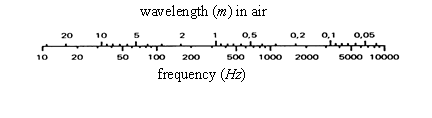

# Acoustics

## Abbreviations and Terminology

**Abbreviations**

| | |
|:-|:--|
|ANSI | American National Standards Institute|
|\(\text{dB}\) | decibels|
|\(f\) | frequency, cycles/sec|
|\(p\) | pressure|
|\(\text{pW}\) | \(10^{-12}\) Watts|
|\(x\) | \(\mathrm{RMS}\) value of quantity|
|\(x_0\) | reference value of quantity|
|\(\mu Pa\) | \(10^{-6}\) Pascals|
|\(\text{Hz}\) | Hertz|
|\(nm\) | \(10^{-9}\) meters|
|\(P\) | sound power |

**Terminology**

| | |
|:-|:------|
|decade | band with the upper frequency x10 that of the lower|
|decibels | measure of a magnitude, \(\text{dB} = 10 \log_{10}\) (mag)|
|far field | beyond the near field (region where sound level drops \(-6\,\text{dB}\) as distance from the source doubles).|
|Hertz | frequency in cycles/second|
|narrow band | band whose width is less than one-third octave but less than \(1\%\) of the center frequency near field range within a distance equal to the wavelength of the lowest frequency emitted or twice the greatest dimension of the subject|
|octave | a band with the upper frequency exactly twice the lower frequency[^1] |
|pink noise | has equal energy in each octave from \(20\) to \(20\,000\) Hz, or with an energy content inversely proportional to frequency|
|random noise | does not have a uniform frequency spectrum and has an amplitude, as a function of time, consistent with a Gaussian distribution curve|
|third-octave | highest frequency \(= 1.26\) x lower frequency (ratio \(= 2^{\frac{1}{3}}\))|
|white noise | has a constant spectrum level over the entire band of audible frequencies (need not be random)|

## Acoustic Velocities, Spectrum, and Reference Levels

**Acoustic Velocity (speed of sound)**

| Medium                 | Approximate Velocity, \(\frac{\text{m}}{\text{s}}\) |
|------------------------|----------------------------------------------------:|
| Air (\(20° \text{C}\)) | \(343\)                                             |
| Fresh water            | \(1\,480\)                                          |
| Aluminum               | \(5\,150\)                                          |
| Concrete               | \(3\,600\)                                          |
| Glass                  | \(5\,300\)                                          |
| Steel                  | \(6\,000\)                                          |

\[
\text{Wavelength, } \lambda = \frac{\text{acoustic velocity}}{\text{frequency}}
\]

Human hearing range is approximately \(20\) to \(20\,000 \text{ Hz}\) 

* Ultrasound lies above \(20\,000 \text{ Hz}\) 
* Infrasound lies below \(20 \text{ Hz}\) 

**Acoustic Reference Levels**

| Quantity | Formula | Reference |
|:--|:-|:-|
| Velocity \( \left( L_v \right) \)  | \(20 \log \left( \frac{v}{v_0} \right) \) | \(v_0 = 10 \frac{\text{nm}}{\text{s}^2} \) |
| Intensity \( \left( L_I \right) \) | \(10 \log \left( \frac{I}{I_0} \right) \) | \(I_0 = 1 \frac{\text{pW}}{\text{m}^2} \) |
| Sound Power Level \( \left( L_W \right) \) | \(10 \log \left( \frac{P}{P_0} \right) \) | \(P_0 = 1 \text{ pW} \) |
| Sound Pressure Level, \(\mathrm{SPL}\) \( \left( L_p \right) \) | \(20 \log \left( \frac{p}{p_0} \right) \) | \(P_0 = 1\,\mu\text{Pa (air)} \) |
| Pressure Spectrum Level \( \left( \mathrm{PSL} \right) \)[^2] | \(\mathrm{SPL} - 10 \log \Delta f \) | \(\text{dB}\) |
| Pressure Band Level \( \left( \mathrm{PBL} \right) \) | \(\mathrm{PSL} + 10 \log \Delta f \) | \(\text{dB}\) |
| Overall SPL \( \left( \mathrm{OASPL} \right) \) | \(10 \log_{10} \sum 10^{\frac{\mathrm{SPL}}{10}} \) | \(20\,\mu\text{Pa (air)}\)|

## Acoustic Pressure and Intensity

**Sound Pressure from Sound Power**

| | |
|-|-|
| Transmission Environment | \(L_p\) |
| Free Field | \(L_W + \log Q - 20 \log r - 10.8 \text{ dB}\) |
| Reflecting Plane | \(L_W + \log Q - 20 \log r - 7.8 \text{ dB}\) |
| Reverberant Room | \(L_W + \log Q - 20 \log R - 6.2 \text{ dB}\) |

where 

\begin{align}
r &= \text{distance from source}\\
Q &= \text{directivity index of source}\\
R &= \text{room constant}\\
\end{align}

**Acoustic Intensity**

\[
I - \frac{\text{Imaginary} \left[ G_{yx} \left( f \right) \right]}{4 \pi \rho_0 \Delta r f} = \frac{\text{Im} \left[ G_{yx} \left( f \right) \right]}{16.25 \Delta r f} \left( \text{for air} \right)
\]

where 

\begin{align}
\rho_0 &= \text{fluid density} = 1.293 \frac{\text{kg}}{\text{m}^3} \text{ for air}\\
\Delta r &= \text{microphone spacing (meters)}\\
f &= \text{frequency}
\end{align}

**Intensity Spectrum Level (ISL)**

Intensity level of a sound contained within a band 1 \(\text{Hz}\) wide

\[
\mathrm{ISL} = 10 \log \frac{I}{I_0 \Delta f} = \mathrm{IL} - 10 \log \Delta f \left( \text{dB} \right)
\]

where

\begin{align}
f &= \text{center frequency of band} \\
I &= \text{sound intensity} \left( \frac{\text{watts}}{\text{m}^2} \right) \\
I_0 &= 10^{-12} \frac{\text{watt}}{\text{m}^2} \text{reference intensity} \\
\Delta f &= \text{bandwidth} \left( \text{Hz} \right) \\
\end{align}

## Acoustic Weighting Curves

(ANSI S1.4 1983)

Weighting for SPL

| Nominal Freq | Exact Freq | A | B | C |
|-----:|-----:|--:|--:|--:|
| \(\text{Hz}\) |\(\text{Hz}\) | \(\text{dB}\) | \(\text{dB}\) | \(\text{dB}\) |
| \(10.0\)    | \(10.00\)    | \(-70.4\) | \(-38.2\) | \(-14.3\) |
| \(12.5\)    | \(12.59\)    | \(-63.6\) | \(-33.3\) | \(-11.3\) |
| \(16.0\)    | \(15.85\)    | \(-56.4\) | \(-28.3\) | \(-8.4\)  |
| \(20.0\)    | \(19.95\)    | \(-50.4\) | \(-24.2\) | \(-6.2\)  |
| \(25.0\)    | \(25.12\)    | \(-44.8\) | \(-20.5\) | \(-4.4\)  |
| \(31.5\)    | \(31.62\)    | \(-39.5\) | \(-17.1\) | \(-3.0\)  |
| \(40.0\)    | \(39.81\)    | \(-34.5\) | \(-14.1\) | \(-2.0\)  |
| \(50.0\)    | \(50.12\)    | \(-30.3\) | \(-11.6\) | \(-1.3\)  |
| \(63.0\)    | \(63.10\)    | \(-26.2\) | \(-9.4\)  | \(-0.8\)  |
| \(80.0\)    | \(79.43\)    | \(-22.4\) | \(-7.3\)  | \(-0.5\)  |
| \(100.0\)   | \(100.00\)   | \(-19.1\) | \(-5.6\)  | \(-0.3\)  |
| \(125.0\)   | \(126.90\)   | \(-16.2\) | \(-4.2\)  | \(-0.2\)  |
| \(160.0\)   | \(158.50\)   | \(-13.2\) | \(-2.9\)  | \(-0.1\)  |
| \(200.0\)   | \(199.50\)   | \(-10.8\) | \(-2.0\)  | \(0.0\)   |
| \(250.0\)   | \(251.20\)   | \(-8.7\)  | \(-1.4\)  | \(0.0\)   |
| \(315.0\)   | \(316.20\)   | \(-6.6\)  | \(-0.9\)  | \(0.0\)   |
| \(400.0\)   | \(398.10\)   | \(-4.8\)  | \(-0.5\)  | \(0.0\)   |
| \(500.0\)   | \(501.20\)   | \(-3.2\)  | \(-0.3\)  | \(0.0\)   |
| \(630.0\)   | \(631.00\)   | \(-1.9\)  | \(-0.1\)  | \(0.0\)   |
| \(800.0\)   | \(794.30\)   | \(-0.8\)  | \(0.0\)   | \(0.0\)   |
| \(1\,000.0\)  | \(1\,000.00\)  | \(0.0\)   | \(0.0\)   | \(0.0\)   |
| \(1\,250.0\)  | \(1\,259.00\)  | \(0.6\)   | \(0.0\)   | \(0.0\)   |
| \(1\,600.0\)  | \(1\,585.00\)  | \(1.0\)   | \(0.0\)   | \(-0.1\)  |
| \(2\,000.0\)  | \(1\,995.00\)  | \(1.2\)   | \(-0.1\)  | \(-0.2\)  |
| \(2\,500.0\)  | \(2\,512.00\)  | \(1.3\)   | \(-0.2\)  | \(-0.3\)  |
| \(3\,150.0\)  | \(3\,162.00\)  | \(1.2\)   | \(-0.4\)  | \(-0.5\)  |
| \(4\,000.0\)  | \(3\,981.00\)  | \(1.0\)   | \(-0.7\)  | \(-0.8\)  |
| \(5\,000.0\)  | \(5\,012.00\)  | \(0.6\)   | \(-1.2\)  | \(-1.3\)  |
| \(6\,300.0\)  | \(6\,310.00\)  | \(-0.1\)  | \(-1.9\)  | \(-2.0\)  |
| \(8\,000.0\)  | \(7\,943.00\)  | \(-1.1\)  | \(-2.9\)  | \(-3.0\)  |
| \(10\,000.0\) | \(10\,000.00\) | \(-2.5\)  | \(-4.3\)  | \(-4.4\)  |
| \(12\,500.0\) | \(12\,589.00\) | \(-4.3\)  | \(-6.1\)  | \(-6.2\)  |
| \(16\,000.0\) | \(15\,849.00\) | \(-6.7\)  | \(-8.5\)  | \(-8.6\)  |
| \(20\,000.0\) | \(19\,953.00\) | \(-9.3\)  | \(-11.2\) | \(-11.3\) |

 

## 1/3 Octave Center Frequencies

(ANSI S1.6 1984)

| Band No. | Nominal Center | Exact Center | Octave Center |
|-----:|--------:|------:|-------:|
|   \#    | \(\text{Hz}\) | \(\text{Hz}\) | \(\text{Hz}\) | \(\text{Hz}\) |
| \(1\)  | \(1.25\)     | \(1.26\)     |           |
| \(2\)  | \(1.60\)     | \(1.58\)     |           |
| \(3\)  | \(2.00\)     | \(2.00\)     | \(2\)     |
| \(4\)  | \(2.50\)     | \(2.51\)     |           |
| \(5\)  | \(3.15\)     | \(3.16\)     |           |
| \(6\)  | \(4.00\)     | \(3.98\)     | \(4\)     |
| \(7\)  | \(5.00\)     | \(5.01\)     |           |
| \(8\)  | \(6.30\)     | \(6.31\)     |           |
| \(9\)  | \(8.00\)     | \(7.94\)     | \(8\)     |
| \(10\) | \(10.00\)    | \(10.00\)    |           |
| \(11\) | \(12.50\)    | \(12.59\)    |           |
| \(12\) | \(16.00\)    | \(15.58\)    | \(16\)    |
| \(13\) | \(20.00\)    | \(19.95\)    |           |
| \(14\) | \(25.00\)    | \(25.12\)    |           |
| \(15\) | \(31.50\)    | \(31.62\)    | \(32\)    |
| \(16\) | \(40.00\)    | \(39.81\)    |           |
| \(17\) | \(50.00\)    | \(50.12\)    |           |
| \(18\) | \(63.00\)    | \(63.10\)    | \(63\)    |
| \(19\) | \(80.00\)    | \(79.43\)    |           |
| \(20\) | \(100.00\)   | \(100.00\)   |           |
| \(21\) | \(125.00\)   | \(125.89\)   | \(125\)   |
| \(22\) | \(160.00\)   | \(158.49\)   |           |
| \(23\) | \(200.00\)   | \(199.53\)   |           |
| \(24\) | \(250.00\)   | \(251.19\)   | \(250\)   |
| \(25\) | \(315.00\)   | \(316.23\)   |           |
| \(26\) | \(400.00\)   | \(398.11\)   |           |
| \(27\) | \(500.00\)   | \(501.19\)   | \(500\)   |
| \(28\) | \(630.00\)   | \(630.96\)   |           |
| \(29\) | \(800.00\)   | \(794.33\)   |           |
| \(30\) | \(1\,000.00\)  | \(1\,000.00\)  | \(1\,000\)  |
| \(31\) | \(1\,250.00\)  | \(1\,258.90\)  |           |
| \(32\) | \(1\,600.00\)  | \(1\,584.90\)  |           |
| \(33\) | \(2\,000.00\)  | \(1\,995.30\)  | \(2\,000\)  |
| \(34\) | \(2\,500.00\)  | \(2\,511.90\)  |           |
| \(35\) | \(3\,150.00\)  | \(3\,162.30\)  |           |
| \(36\) | \(4\,000.00\)  | \(3\,981.10\)  | \(4\,000\)  |
| \(37\) | \(5\,000.00\)  | \(5\,011.90\)  |           |
| \(38\) | \(6\,300.00\)  | \(6\,309.60\)  |           |
| \(39\) | \(8\,000.00\)  | \(7\,943.30\)  | \(8\,000\)  |
| \(40\) | \(10\,000.00\) | \(10\,000.00\) |           |
| \(41\) | \(12\,500.00\) | \(12\,589.30\) |           |
| \(42\) | \(16\,000.00\) | \(15\,848.90\) | \(16\,000\) |
| \(43\) | \(20\,000.00\) | \(19\,952.60\) |           |

 

## References

|||
|-|---------------|
|13.1| Beranek, Leo L., "Acoustic Measurements," John Wiley & Sons, New York, New York, 1956.|
|13.2| Peterson, Arnold P.G. and Gross, Ervin E., Jr., "Handbook of Noise Measurement," GenRag Incorporated, Concord, Massachusetts, 1978.|
|13.3| "Measuring Sound," (Pamphlet), Bruel & Kjaer, Naerum, Denmark, September 1984.|
|13.4| "Pocket Handbook, Noise, Vibration, Light, Thermal Comfort," Bruel & Kjaer, Naerum, Denmark, 1986.|

**Additional Reading**

||
|-|
|Hunter, Joseph L., "Acoustics," Prentice-Hall Incorporated, Englewood Cliffs, New Jersey, 1957.|

[^1]: Common octaves include, in \(\text{kHz}\) \begin{align} 0.0375&-0.0750\\0.075&-0.15\\0.15&-0.30\\0.30&-0.60\\0.6&-1.2\\1.2&-2.4\\2.4&-4.8\\4.8&-9.6\end{align}
[^2]: The \(\mathrm{SPL}\) contained within a band \(1 \text{ Hz}\) wide