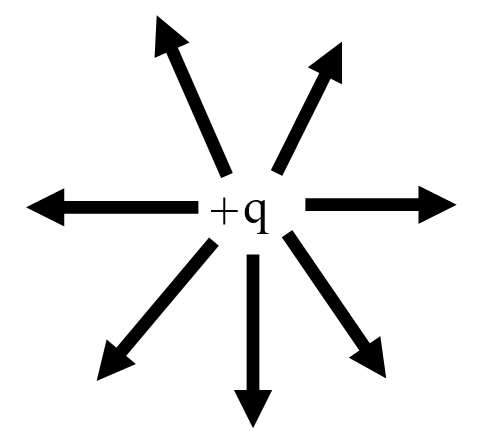
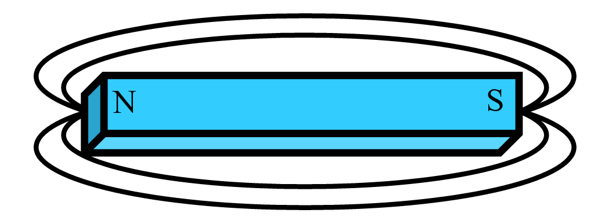
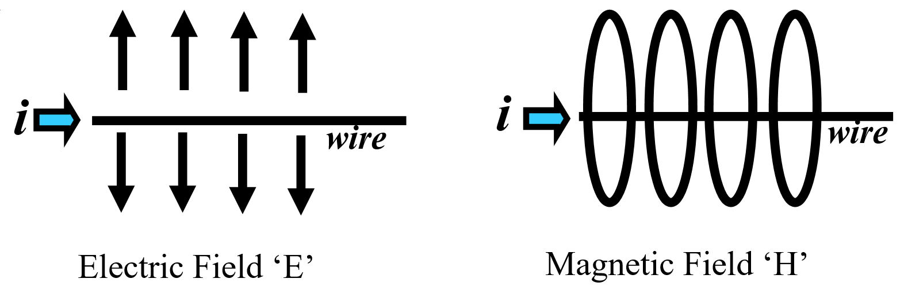
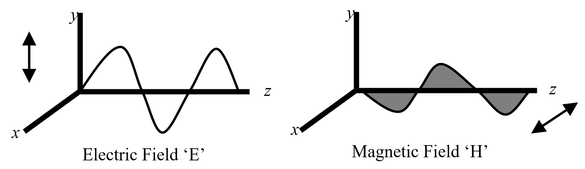
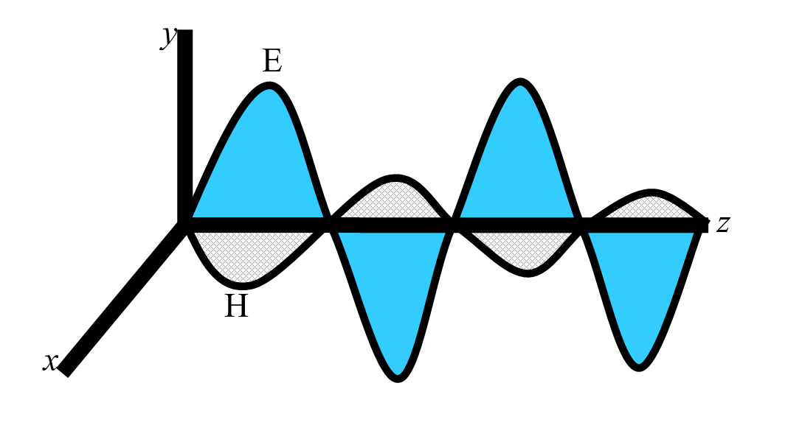

# Electromagnetic Compatibility

## Electromagnetic Compatibility (EMC)

This section gives the Flight Test Engineer a basic introduction to terms and 
concepts used by EMC engineers and insight into good testing philosophy and 
appropriate practices thus improving the interaction between the EMC and Flight 
Test engineers.

## Abbreviations

| | | |
|-|-|-|
| \(A\) | Area | \(\text{m}^2\) |
| \(c\) | Speed of Light | \(3.0\times 10^8 \frac{\text{m}}{\text{s}} \) |
| \(E\) | Electric Field Intensity | Volts/meter, \( \frac{\text{V}}{\text{m}} \) |
| \(f\) | Frequency | Hertz, \(\text{Hz}\) |
| \(H\) | Magnetic Field Intensity | Ampere/meter, \( \frac{\text{A}}{\text{m}} \) |
| \(I\) | Current | Ampere, \(\text{A}\) |
| \(L\) | Inductance | Henries, \(\text{H}\) |
| \(Q\) | Charge | Coulomb, \(\text{C}\) |
| \(V\) | Electric Potential | Volt, \(\text{V}\) |
| \(X_C\) | Capacitive Impedance | Ohms, \(\Omega\) |
| \(X_L\) | Inductive Impedance | Ohms, \(\Omega\) |
| \(\lambda\) | Wavelength | meter, \(\text{m}\) |

## Terms

| | |
|-|-|
| AC | Alternating Current |
| DC | Direct Current |
| EMC | Electromagnetic Compatibility |
| EMI | Electromagnetic Interference |
| Far Field | Distance beyond \(10 \lambda\) |
| HIRF | High Intensity Radiated Fields |
| RF | Radio Frequency |

Decibel Logarithmic (base 10) expression for amplitude ratios.

\begin{align}
\text{dB(power)} &= 10 \log_10 \left( \frac{P_1}{P_2} \right) \\
\text{dB(voltage)} &= 20 \log_10 \left( \frac{V_1}{V_2} \right) \\
\text{dB(current)} &= 20 \log_10 \left( \frac{I_1}{I_2} \right) \\
\end{align}

Commonly used decibels for EMC:

|||
|-|-|
| \(\text{dBm}\) | decibels relative to \(1 \text{ milliwatt}\) |
| \(\text{dBW}\) | decibels relative to \(1 \text{ watt}\) |
| \(\text{dB}\mu\text{V}\) | decibels relative to \(1 \text{ microvolt}\) |
| \(\text{dBi}\) | antenna gain relative to an isotropic antenna |

  -------- ---------- -----------
  **dB**   **Power\   **V or I\
           Ratio**    Ratio**

  0        1          1

  3        2.0        1.4

  6        4          2

  10       10         3.2

  20       100        10

  30       1000       32
  -------- ---------- -----------

**Common Decibel Values**

The sensitivity of a radio receiver can be on the order of 
\(1 \frac{\mu \text{V}}{\text{m}}\), while RF field strengths for 
HIRF can be \(1\,000 \frac{\text{V}}{\text{m}}\), a factor of a 
billion or \(180 \frac{\text{dB}\mu\text{V}}{\text{m}}\).

## Fundamentals

### Electric and Magnetic Fields

A static charge \(Q\), creates a static electric field, \(E\).

{width="2in"}

A common magnet produces a static magnetic field, \(H\).

{width="4in"}

Transferring charge \(Q\), i.e. DC current on a wire creates both a constant 
magnitude electric and magnetic field.

{width="5in"}

An amplitude varying charge, i.e. changing current (AC), will generate a time 
varying electric and magnetic Field in different planes.

{width="5in"}

Plane waves that are self sustaining electric and magnetic Fields and combine 
in the far field, are commonly called an electromagnetic wave.

{width="3in"}

### Antennas

Antennas can transmit and/or Receive RF equally well. Electrical length 
determines effectiveness.

\(\frac{\lambda}{2}\) is an efficient antenna element length

where:

\[
\lambda = \frac{c}{f}
\]

  -------------------- ---------------------------
  **Frequency, \(f\)** **Wavelength, \(\lambda\)**
  3 MHz                100m
  30 MHz               10 m
  150 MHz              2 m
  300 MHz              1 m
  3 GHz                0.10 m
  -------------------- ---------------------------

**Common Wavelengths**

**Slots** that have favorable electrical lengths are effective antenna elements 
also, i.e. hatches, doors, avionics metal enclosure seams and ventilation holes.

**Loop Area** is the area encapsulated between the signal line and its return 
path that can be an effective antenna. The larger the loop (capture) area, the 
better the antenna effectiveness is.

#### Spectra 

Spectra are the frequency content of the electronic signals and are an important 
consideration in understanding EMI issues. Periodic signals contain energy at 
various frequencies and as such, a frequency domain approach is needed. How much 
energy at what frequency depends largely on the type of periodic signal, (i.e. 
square wave or sine wave), initial frequency and rise/fall times of the signal. 
The faster the rise/fall times are, the more spectral content will be developed 
in the signal, most of which will be unintentional and unwanted. This is 
mathematically demonstrated by the use of a trigonometric Fourier series.

#### Non-Ideal behavior of components

Non-ideal behavior of components can exists in discrete components such as 
resistors, capacitors, inductors and even wire when operated at off nominal 
conditions, for example temperature. Another condition is frequency. For 
example, a short grounding wire from a DC perspective is a dead short, 
neglecting the extremely small inductance. But at some frequency, this 
inductance gets large enough to be a factor, for example on a bonding strap for 
lightning protection. A \(26 \text{ gauge}\) wire, \(1 \text{ inch}\) above a 
ground plane will have \(0.028 \mu\text{H}\) per inch of inductance, \(L\).

where:

\(X_L = 2\pi f L\)

For \(f = 150 \text{ MHz}\), \(X_L = 26.4 \frac{\Omega}{\text{inch}}\) of wire 
which can be significant. To reduce this, replace the ground wire with a wide 
strap.

## Electromagnetic Interference (EMI)

**Electromagnetic Compatibility (EMC)** is defined as systems that:

1. don't interfere with other systems;
2. are tolerant of interference from other systems;
3. don't interfere with itself.

**Broadband Interference** is interfering signals over a large range of 
frequencies. These can be associated with spark producing equipment like motors 
that can create signals with lots of spectral content.

**Narrowband Interference** is interfering signals that have a limited range of 
frequencies, usually a single frequency along with it's harmonics. These can be 
associated with digital devices that have periodic characteristics like clocks.

### Interference Model

The classic interference model is:

Source -> Path -> Victim

To reduce the interference you can:

* Reduce the emissions from the ***Source***
* Disrupt the ***Path***
* Harden the ***Victim***

**Sources** of interference can be clocks, switching power supplies, CPUs, data 
buses, network systems, relays, local oscillators, and transmitter harmonics.

**Coupling Paths** can be signal and power lines, radiating wires, apertures or 
slots on LRUs, windows, door and hatch openings or antennas themselves.

**Front Door Coupling** is meant to be interference coming in the normal path to 
the system, i.e. through the antenna ports to the radio, and can cause 
interference at extremely low power levels \(‑100 \text{ dBm}\).

**Back Door Coupling** is interference coming into the system with the wires 
leading to the system and is of relatively higher power.

**Capacitive Coupling** primarily involves electric waves in the near field and 
is due to voltages on wires.

**Inductive Coupling** primarily involves magnetic waves in the near field and 
is due to current on either wires or chassis.

The aircraft fuselage is sometimes incorrectly thought of as a Faraday Cage 
encapsulating the RF energy inside or preventing it from entering because of its 
aluminum structure, but actually it is not. All of the windows, doors and 
hatches allow RF energy to travel through quite easily.

**Victims** of interference can be radio receivers, VHF, HF, VOR, ILS, ADF, 
Display systems, Audio and Passenger Address system, smoke and fire detection 
circuits, fuel quantity systems. Typically, low energy systems can be 
susceptible.

The reduction or elimination of EMI can be done in three areas; the systems end; 
by modifying the emissions and/or susceptibility requirements; or at the 
aircraft end by modifying the aircraft's wiring or structure.

### Conducted Emissions

Current/signal on wires that are not the intended or primary signal is 
considered conducted emissions. This 'extra' current will be passed along to 
other systems and/or can radiate on those wires acting like antennas.

**Differential Mode** current is made up of the intended signal or information 
and/or noise that goes out on the signal wires and comes back on the return 
lines.

**Common Mode** current is usually just noise that goes out on two or more 
signal/return lines and returns via some other path. This is usually the most 
troublesome in terms of emissions and should be eliminated whenever possible.

### Radiated Emissions

RF energy emanating from the unit/LRU itself through holes, slots and apertures 
or from the interconnecting wires is considered radiated emissions.

### Aviation Frequency Spectrum

The table below lists the frequency spectrum of interest to the aviation 
community. The range is from \(100 \text{ kHz}\) to \(10 \text{ GHz}\), a 
factor of \(10^8\), \(\left(90 \text{ dB}\right)\). The primary interest is 
with equipment that is sensitive to RF energy, i.e. radio receivers, which are 
primarily intended to detect small signals \( \left(-105 \text{ dBm}\right)\). 
Emission requirements are set at a low level that will still allow proper 
operation of the radio receivers. For EMI purposes, emissions from equipment 
should stay clear of these frequencies.

**Aviation Frequencies of Interest**

  **Band**         **Frequency**
  ---------------- -----------------------
  ADF              \(190-1750 \text{ kHz}\)
  HF               \(2-30 \text{ MHz}\)
  Marker Beacon    \(75 \text{ MHz}\)
  VHF Nav          \(108-118 \text{ MHz}\)
  VHF Comm         \(118-138 \text{ MHz}\)
  Glideslope       \(328-335 \text{ MHz}\)
  DME, ATC, TCAS   \(960-1220 \text{ MHz}\)
  GPS              \(1227, 1558, 1575 \text{ MHz}\)
  Glonass          \(1609 \text{ MHz}\)
  Radio Altitude   \(4.2-4.4 \text{ GHz}\)
  MLS              \(5.0-5.25 \text{ GHz}\)
  WXR              \(5.4, 8.8, 9.0-9.3 \text{ GHz}\)

## Testing

### Regulations and Industry Guidance

The following references are regulations and industry guidelines that address 
procedures and acceptable limits for interference testing.

* RTCA DO160D, Chapter 21
* FARs Part 25.1353 and 25.1431
* MIL STD 461
* CISPR
* FCC Part 15
* Aircraft manufacturers own standards

### Lab Testing

Lab testing of the unit using established standards and practices is the first 
and best means of testing. Not only is this where you will find the trouble 
spots (i.e. frequencies) but also is a place where some troubleshooting could 
alleviate potential problem areas. Contracts with LRU vendors should be written 
to require the equipment pass these tests, identified above, before delivery. A 
list of frequencies that exceed an established limit is the result.

### Aircraft Ground Testing

After lab testing, the unit should be installed in the airplane and be tested 
with the installed shops wiring. Testing will consist of measuring conducted 
emissions with current probes on wire bundles associated with the new equipment.

Radiated emissions are tested by using the aircraft's antennas hooked to test 
equipment to determine how much RF energy is getting into these sensitive 
systems. Again, a list of frequencies that exceed an established limit is the 
result.

### Aircraft Flight Testing

Only after both lab and ground testing is accomplished can a meaningful flight 
test occur. The results of the ground test should produce a list of frequencies 
of some exceedance or observed interference. It is usually only these 
frequencies that need to be cleared in flight. The appropriate systems should be 
tuned to those frequencies and with the equipment to be tested in its' operating 
mode, determine if there is objectionable interference, (usually a pilots 
subjective opinion). Pilots can evaluate systems only if adequate lab/ground 
testing has been done beforehand. EMI issues that are found in flight test are 
very difficult and expensive to fix at this stage, and can typically only reduce 
or mask the problem.

### Avionics changes and EMI testing

Changes in the hardware/wiring of a piece of avionics that could affect EMI 
testing are:

* Processor speeds
* Power Supply changes
* Frequency sensitive components, capacitors and inductors
* Circuit card layout and repackaging changes

Software changes typically don't affect EMI unless software controls/switches 
hardware related functions, i.e. speeds, options, peripherals etc.

## Lightning

Lightning is a very large electrical transient that can impart thousands of 
Amperes of current through an aircraft structure. The structure needs to present 
a low impedance path for the lightning current so that no damage causing arcing 
and/or over-heating occurs. Additionally nearby wiring needs to be shielded to 
protect against the induced current produced by the ever changing magnetic 
fields.

### Aircraft Lightning Zones

The aircraft is divided into different areas that relate to the probability of a 
lightning attachment. The nose, tail, wingtips and engine nacelles (extremities) 
are more likely areas.

### Direct Effects

Direct effects of a lightning attachment can be in the form of heating, arcing 
and acoustic issues. Designing the structure to handle the current flow and 
providing a low impedance path for the lightning current will greatly minimize 
these effects.

### Indirect Effects

Indirect effects considers the current that is induced by the transient and 
coupled onto aircraft wiring that is parallel to the main lightning current 
flow. The protection is two fold. Systems are designed and tested to handle 
these types of transients as well as the wiring is addressed to minimize the 
induced transient to these systems. Shielding and good grounding with short 
pigtails at both ends is a good method to reduce the induced current.

### Instrumentation Precaution

Any flight test instrumentation wiring that lies outside the protective fuselage 
needs to be evaluated for both direct and indirect effects of a nearby lightning 
attachment. The sensor itself must be protected from the direct attachment and 
the wiring must be protected from induced current onto that wiring. This current 
may damage the data system equipment and/or, other aircraft systems that are 
also instrumented. Good shielding and grounding techniques will minimize these 
effects. For more information see the 14.6 Reference at the end of this handbook 
section.

## High Intensity Radiated Fields (HIRF)

Aircraft can be exposed to large RF energy produced by high powered radio 
transmitters or military/airport surveillance radars. These RF fields can 
penetrate the aircraft fuselage through windows and doors/slots which could 
couple with aircraft wiring and/or systems and potentially interfere. This 
threat is addressed by both the aircraft and systems approach.

The systems themselves are designed and tested to be immune to a particular 
level of RF. These levels are determined by the criticality of the systems and 
are specified in regulatory material. Testing is usually done in a laboratory 
environment.

From the aircraft side, the internal wiring for critical systems is protected 
with appropriate shielding and grounding. Aircraft ground testing is done at 
special facilities that can radiate the vehicle with large RF fields with 
instrumentation inside to measure the penetration and to verify correct system 
operation.

## Precipitation Static (P-static)

This occurs due to a buildup of static charges that discharge by noisy arcing 
from/to various parts of the aircraft. The static buildup is caused by 
tribo-electric charging from the aircraft impacting snow/rain/ash particles in 
the air while flying. This charge should gracefully exit the aircraft through 
static wicks installed on the wingtips and empennage tips. If it doesn't the 
problem shows up as broad banded noise (white noise) heard on receivers such as 
ADF, HF and to some extent VHF as the aircraft flies through the precipitation.

Typical causes are access panels (composite and metal), cowling and fairings 
that are not properly grounded. Ground straps do a good job of not isolating 
parts. (Note: these straps should not be used for lightning protection as they 
usually are not sized to handle the current).

## References

|||
|-|---------------|
|14.1| Paul, C. R., "Introduction to Electromagnetic Compatibility", John Wiley & Sons Publishing, 1992|
|14.2| Ott, H. W, "Noise Reduction Techniques in Electronic Systems", John Wiley & Sons Publishing, 1988|
|14.3| Hrehov, D. W. and Walen, D. B., "What Flight Test Crews Need to Know About EMI/EMC", *34^th^ Annual SFTE Symposium Workshop,* 2003|
|14.4| Federal Aviation Regulations, Part 25|
|14.5| RTCA DO160D, "Environmental Conditions and Test Procedures for Airborne Equipment", 1997|
|14.6| Hrehov, D. W., "What Instrumentation Engineers Need to Know About Lightning", *31^st^ Annual SFTE Symposium,* 2000|
|14.7| Fisher, F. A., Perala, F. A., and Plumer, J A., "Lightning Protection for Aircraft", Lightning Technologies Inc., 1990|
