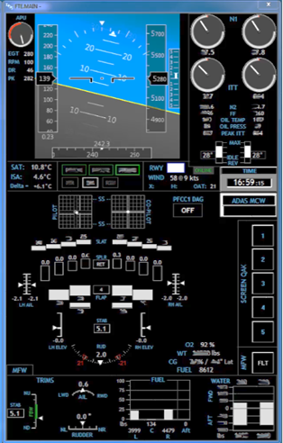
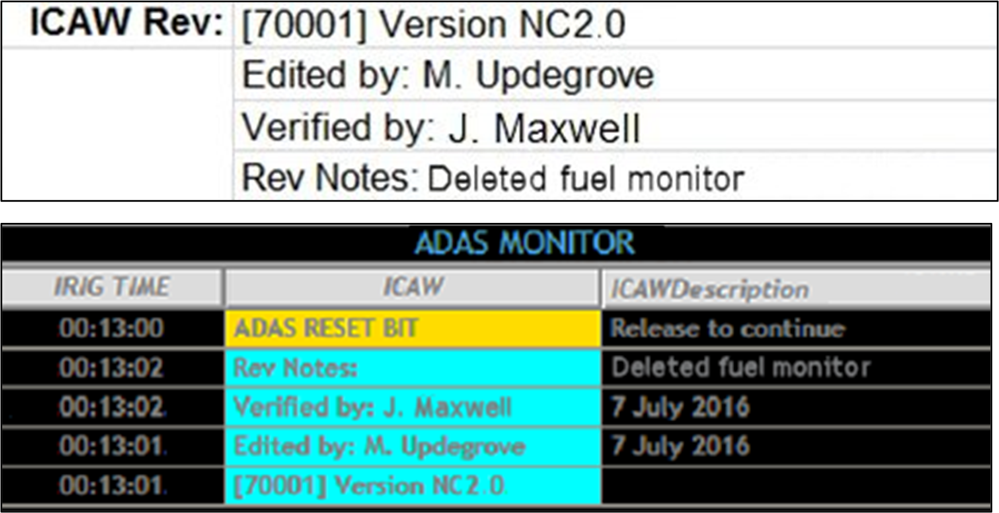

# Real-Time Data Display Guidelines

```{r, echo=FALSE}
colorize <- function(x, txtcolor, boxcolor) {
  if (knitr::is_latex_output()) {
    if (substr(x,1,1) == "#") {x <- paste("\\",x, sep="")}
    sprintf("\\colorbox[HTML]{%s}{\\textcolor[HTML]{%s}{%s}}", boxcolor, txtcolor, x)
  } else if (knitr::is_html_output()) {
    sprintf("<span style='padding-top: 10px; 
                          padding-right: 10px; 
                          padding-left: 10px; 
                          padding-bottom: 10px; 
                          background-color: #%s; 
                          color: #%s;'>%s</span>", boxcolor, txtcolor, x)
  } else x
}
```

***[Author]{.underline}:***

***Mark Updegrove***

***(email: mark.updegrove\@outlook.com)***

***[Contributing Editors]{.underline}:***

***Mark Mondt, Steve Carothers, Brian Maisler, Bill Kuhlemeier, Nathan Cook,***

***Amit Alex, Libin Daniel, Ben Povall, Hunter Bloch, Andre Celere***

This section provides "best practice guidelines" for building real-time flight test monitoring displays. The goal of a well-designed display is to present information, not merely data, to the user. These guidelines are applicable for both on-aircraft and telemetry-based control room displays. While the guidelines are aimed primarily at the FTE/Test Conductor/Test Director role, the principles are applicable to any engineering displays that support the real-time flight test mission.

**[Display Guidelines]{.underline}**

1.  **General** -- No set of guidelines can cover all potential situations. In cases where a conflict between specific items arises, judgment is required as to how to honor the overall intent of the guidelines while still accomplishing the intended mission.
    a.  Criticality and Application
        1. The level of diligence put into building the display should be commensurate with the criticality of the display.
        1. The intended users of these guidelines are those FTEs who, either on the aircraft or in the control room, make real-time decisions that affect the safety of the crew and the integrity of the aircraft.
        1. Displays which are safety critical should be identified as such, versus displays which provide situational awareness information only.
        1. As the criticality of a display increases, more care should be taken to ensure the display conveys critical information, without being cluttered by non-critical data.
        1. To the greatest extent practical, displays should tightly follow a common design philosophy across the individual test assets within a program, as well as across various platform types within an organization.
    a.  Organization -- Roles and Responsibilities of Users
        1. The primary responsibility of the overall display layout and functional design should be placed on an experienced FTE.
        1. The cognizant FTE should have a robust knowledge of the aircraft/systems under test, the types of testing to be performed, and the manner in which the FTEs will conduct the test and make decisions.
        1. The cognizant FTE should ensure that displays are designed in order to allow data quality and basic pass/fail criteria to be easily assessed during test conduct.
        1. In no circumstance should the creation of data displays be blindly delegated to the least experienced person on the team, without direct guidance and oversight from a more senior FTE.
1.  **Visual Elements** -- Visual elements are the interface layer at which the FTE integrates operationally with the aircraft. This is perhaps the area that has the largest immediate impact on any FTE's ability to act efficiently and safely during a test. Consequently, careful thought should be given to visual element design when building displays.
    a.  Human Factors^2,3,4,7^
        1. Design displays to deliver data in a manner that accommodates the basic human factors strengths/weaknesses of the users.
        1. Follow the basic human factors design philosophies of cockpit displays, adding information as required to enable the FTE to perform their function.
        1. Avoid cluttered displays by utilizing negative (empty space) to allow spatial differentiation of data.
        1. Data displays should not have more than \~60% of the overall display space occupied with visual elements (1.e., at least 40% empty space).
        1. The display should utilize color, contrast, and a thoughtful layout to maximize legibility and reduce clutter.
    a.  Contrast
        1. Contrast is the primary visual cue for users to efficiently locate information on a display^7^. Use contrast appropriately.
        1. Contrast is used primarily to manage the user's attention, and increase legibility of elements on a display^7^.
        1. Contrast can also be a useful tool to provide non-distracting contextual cues to data (1.e., background lines, grouping boxes, etc).
        1. In general, the most critical and useful elements on a display should have the highest contrast against the background (color usage as status information is addressed separately, below).
        1. Less important or less useful elements should have less contrast, allowing them to be easily ignored when the FTE's brain is highly saturated with critical tasks. See Fig 1 below.

        (ref:perceptual-hierarchy) *Fig 1: Example of a perceptual hierarchy^7^ using contrast, with IADS^©^ compatible hex codes listed. Note that in this example, stark white is avoided, to reduce the potential for retinal image “ghosting”.*

        ![(ref:perceptual-hierarchy)][21001]

    a.  Color
        1. Color is a secondary visual cue which allows users to more efficiently sort and interpret information on a display^6^.
        1. Color should not be the only discriminator used, especially for critical data. 

            > **NOTE:** See Appendix A, or MIL-STD-1472^3^ for specific guidance on color usage for color vision deficient users.

        1. Color can provide information that can quickly give the FTE insight as to the purpose of the data, as well as its health, status, proximity to a limit, etc.
        1. Each screen element should have a meaningful color that represents the type of information it is displaying. The following is suggested^8^:

        |Element               |IADS          |Hex           |RGB|
        |----------------------|:------------:|:------------:|:--------------:|
        |Display Background    |**`r colorize("0x000000", "000000", "FFFFFF")`**|**`r colorize("#000000", "000000", "FFFFFF")`**|**`r colorize("000, 000, 000", "000000", "FFFFFF")`**|
        |Data Label/Text       |**`r colorize("0xF7B634", "34B6F7", "000000")`**|**`r colorize("#34B6F7", "34B6F7", "000000")`**|**`r colorize("052, 182, 247", "34B6F7", "000000")`**|
        |Data w/no Limits      |**`r colorize("0xE0E0E0", "E0E0E0", "000000")`**|**`r colorize("#E0E0E0", "E0E0E0", "000000")`**|**`r colorize("224, 224, 224", "E0E0E0", "000000")`**|
        |Data with Limits:^†^  |              |              |                 |
        |Nominal      |**`r colorize("0x00C000", "00C000", "000000")`**|**`r colorize("#00C000", "00C000", "000000")`**|**`r colorize("000, 192, 000", "00C000", "000000")`**|
        |Caution      |**`r colorize("0x00F0FF", "FFF000", "000000")`**|**`r colorize("#FFF000", "FFF000", "000000")`**|**`r colorize("255, 240, 000", "FFF000", "000000")`**|
        |Warning      |**`r colorize("0x0000FF", "FF0000", "000000")`**|**`r colorize("#FF0000", "FF0000", "000000")`**|**`r colorize("255, 000, 000", "FF0000", "000000")`**|
        
        > † **NOTE:** Limits should not be assigned arbitrarily. If no engineering guidance and/or substantiation exists for assigning a meaningful limit, the data should be displayed as Data w/no Limit
        
        5. Each representative color should be specifically defined for easy reproduction and consistency.
        1. In general, avoid superfluous or excessive use of color on a display.

            > **NOTE:** Random and/or excessive use of a color reduces the perception of the color as a "novelty", which dilutes its utility as a visual cue. This is especially important for colors that are used for alerting in emergency situations (i.e., red).

        7. A typical display should not contain more than 4 or 5 distinct colors^1^.

            > **NOTE:** "Distinct colors" are those colors which are used for the purpose of information discrimination, aside from the base background and data colors (i.e., black and white).

        8.  Caution and Warning -- An automated alerting/messaging system can greatly aid the FTE in passive monitoring tasks during testing. Depending on software capabilities, the user may implement a variable color status on either the message text itself, or the message background. The following colors are suggested for the associated status levels:

        |Element               |IADS          |Hex           |RGB|
        |----------------------|:------------:|:------------:|:--------------:|
        |Advisory^††^ |**`r colorize("0xFFFF00", "00FFFF", "000000")`**|**`r colorize("#00FFFF", "00FFFF", "000000")`**|**`r colorize("000, 255, 255", "00FFFF", "000000")`**|
        |Caution      |**`r colorize("0x00F0FF", "FFF000", "000000")`**|**`r colorize("#FFF000", "FFF000", "000000")`**|**`r colorize("255, 240, 000", "FFF000", "000000")`**|
        |Warning      |**`r colorize("0x0000FF", "FF0000", "000000")`**|**`r colorize("#FF0000", "FF0000", "000000")`**|**`r colorize("255, 000, 000", "FF0000", "000000")`**|
            
        > †† *See Section 2.g for suggested definitions for Advisory/Caution/Warning*

        9. Color fidelity, contrast, and luminance will all be impacted by the type of monitor hardware used (LED vs LCD), hardware settings, ambient lighting conditions, screen reflectivity, etc. Make sure to evaluate the suitability of the color schemes and general display design on ALL monitors which will be used during real-time flight tests. Make changes as required to accommodate insufficiencies.
        1. If software limitations only allow the use of a single font color against a variable color background, the following is suggested as a compromise to attempt to optimize text legibility against all the various status background colors:

        |Element               |IADS          |Hex           |RGB|
        |----------------------|:------------:|:------------:|:--------------:|
        |Message Text |**`r colorize("0x808080", "808080", "000000")`**|**`r colorize("#808080", "808080", "000000")`**|**`r colorize("128, 128, 128", "808080", "000000")`**|
        |Advisory     |**`r colorize("0xFFFF00", "808080", "00FFFF")`**|**`r colorize("#00FFFF", "808080", "00FFFF")`**|**`r colorize("000, 255, 255", "808080", "00FFFF")`**|
        |Caution      |**`r colorize("0x00F0FF", "808080", "FFF000")`**|**`r colorize("#FFF000", "808080", "FFF000")`**|**`r colorize("255, 240, 000", "808080", "FFF000")`**|
        |Warning      |**`r colorize("0x0000FF", "808080", "FF0000")`**|**`r colorize("#FF0000", "808080", "FF0000")`**|**`r colorize("255, 000, 000", "808080", "FF0000")`**|
            

    a.  Text
        1. Where it is selectable by the user, font should be a sans-serif font. Trebuchet MS regular (not bold), is a suitable choice if available.
        1. Standard font size should generally be 12pt, with a minimum of 10pt (may vary depending on size and resolution of monitor).
        1. Modifications such as bold, underline, etc., should generally be avoided. May be used sparingly when necessary to support legibility, convey separation of purpose (group of data versus individual labels), etc.
        1. Acronyms, abbreviations, button labels, annunciators, etc. should always be set in ALL CAPS.
        1. Regular type case should be used for dialog, "lengthy" text, descriptive text, etc.
    a.  Graphics -- It may be helpful to display some data graphically in order to give the user at-a-glance spatial reference for the current value of the parameter, along with trend information.
        1. Consider graphics (analog indicators - gauges, tapes, needles, etc) for use in identifying trends and relative status within a range.
        1. Consider numerical values for use in hard data, targeting a specific value, etc.
        1. Graphics should always include a numerical value that is adjacent to the tape, preferably in a box and located at the origin, as practical^2^.

            > **NOTE:** Thoughtful combination of numerals and graphics can make for a very scan-friendly layout, which can be "flown to", and used for both low resolution and high resolution monitoring simultaneously.

        4. The variety of different styles of graphics used on a display should be kept to a minimum, with each different application of a specific style (bar, slider, dial, etc) kept consistent for its purpose, and presenting the information in a manner that is visually compelling in the most appropriate sense for the data that is being presented.
        1. Numerical values and their respective boxes should generally be stationary.
        1. For graphics that display basic quantities or relatively steady values, bar graphs/tapes should be the default as reasonable and appropriate. See Fig 2 below.
        
        (ref:bar-graph) *Fig 2: Example of bar graphs used to represent hydraulic system temperatures and quantities.*

        ![(ref:bar-graph)][bar-graphs]
        
        7. For graphical displays of physical positions of components (i.e., flight control surfaces), sliders with pointers may be preferred.
        1. In some cases, such as N1 and EGT, dials may be preferred, especially if this reflects similar implementation to the cockpit displays.
        1. Time history charts (strip charts) can be very useful for monitoring behavior over time, spotting trends or oscillations, and monitoring proximity to limits.

            > **NOTE:** One very useful benefit of a time history chart is the ready ability for the FTE to visually identify an increasing trend toward a safety limit, thus allowing for proactive abort calls.

        10. Time history charts (strip charts) may also provide the ability for real time basic analysis functions (slope calculations, fast fourier transforms, etc). The availability of these features will be software dependent.

            >**NOTE:** Excessive use of strip charts on a display may impact computer processing performance.

        11. Minimize the use of tickmarks and gridlines to avoid overpowering the data (also ref section 2.b,c -- color and contrast).
        1. Create graphics that are only as complex as necessary, and are as simple as practical.
        1. For any graphics that change to show a component status or state (1.e., open/closed), ensure that the transition or invalid signal state is also clearly conveyed.
        1. Consider the use of a "synoptic" style display for intuitive display of a system, versus a graphical reproduction of the actual physical layout. (Placement of components relative to system operation, versus actual installation -- Ref Fig 3, next page).
        
        (ref:synoptic) *Fig 3: Example flight control synoptic using a combination of basic IADS^©^ graphical tools. Note that the control surface graphics are laid out in a manner relative to their placement on the aircraft (a typical business jet configuration as seen from roughly above/behind) without attempting to graphically reproduce the actual aircraft in its entirety.*

        ![(ref:synoptic)][21003]
        
        15. Take care to create graphics which do not falsely lead the user to assume things about the system state which are not true, or are not actually being measured. For graphics where verification of a response to a command is critical, consider showing the command value with a hollow or shadowed indicator, and the actual value with a solid or filled indicator. See Fig 4 below.
        
        (ref:hollow-fill) *Fig 4: Example of hollow pointers used to show N1 command, with filled pointers to show actual N1.*

        ![(ref:hollow-fill)][hollow-pointer]

    a.  Sense and Direction -- When utilizing graphics, care should be taken to ensure that the indications on the display are intuitive and non-distracting.
        1. Tapes or bar graphs utilized on the periphery of an attitude indicator should be evaluated to ensure there is no situation where the movement of the tapes could induce a false perception of attitude changes.
        1. Moving graphics should be carefully constructed to convey a correct intuitive sense of movement that correlates with the reality it is representing.
        1. Increasing values should typically move: clockwise (dial), up (tape/bar graph), or right (slider/gauge)^2^.
        1. When using moveable graphics, consider which elements remain fixed, and which will move. Consider the impact on the users' ability to scan the display, and quickly read and understand the data.
        1. In general, look for any susceptibility to misinterpretation or confusion due to the presentation method.
    a.  Alerting features -- Consider the implementation of any available alerting features in order to increase the test team's ability to perform safely and efficiently. IADS^©^, in particular, has multiple alerting tools which can greatly increase the user's situational awareness, while allowing their attention to remain focused on more real-time critical functions.
        1. The following terminology for criticality levels is suggested (*See Sec 2.c for associated color guidelines*):

            [Advisory]{.underline} -- Condition which represents a non-critical degradation of functionality, loss of redundancy, etc. No immediate action is required, but some minor actions may be required to continue nominal operations. No damage to aircraft or injury to personnel is expected.

            [Caution]{.underline} -- Condition which represents a potentially critical degradation of functionality, failure of systems, unsustainable modes of operation, etc. Immediate action may not be required, but if no action is taken, damage to aircraft or injury to personnel may be possible.

            [Warning]{.underline} -- Condition which represents a critical degradation of critical functionality, total system failure, etc. Immediate action is required in order to avoid damage to aircraft and/or injury to personnel.

        2.  Ensure that alerting functions are robust, reliable, easily recognizable, and allow the user to quickly diagnose any emerging situation.
        1. Carefully consider what items will be subject to automated alerting, and why.
        1. Alerting functions should enhance the FTE's ability to focus on the important elements of a test, without being distracted by more mundane monitoring tasks.
        1. Safety of a test can also be enhanced, particularly if the limiting criteria for a complex or dynamic test are multi-dimensional or difficult to interpret in real time.
        1. Ensure that any alerting features are readily understood by any and all users of the system, and that each user can verify the status of the system prior to use.
        1. Any alerting system should have configuration control and version monitoring which can be verified by the user prior to use.
        1. Each user should understand the automated alerting logic used in the display.
        1. Ensure that alerting functions do not produce nuisance or spurious alerts (e.g., persistent flashing, blinking, etc.).
    a.  Limits on ability to absorb info
        1. Update rates for data displays should generally be no higher than 8-10hz.
        1. For general numerical data, consider filtering the data down to 2-4hz to minimize flickering or dithering.
        1. Graphical elements (gauges, tapes, etc.), should be filtered to the lowest usable level to minimize flickering or dithering.

            > **NOTE:** When filtering data to avoid flickering, ensure that the data can be still be verified as "alive" at a glance, and is not slowed to the point of being misleading or lagging.

        4.  The level of significant digits shown should be the lowest that adequately displays the data for the intended purpose^5^.
        1. A single FTE should not have more than 4 critical parameters to monitor at a given point in time.

            > **NOTE:** The above statement is in reference to parameters where the FTE must dedicate cognitive function to actively monitoring critical data. This does not include automated monitoring and alerting functions performed by the computer, in cases where an alert will be automatically posted in clear view of the FTE.

    a.  Use of control elements -- As the computing packages grow in complexity, they introduce the ability to create control elements on the displays. This gives the users the ability to interact with the displays to give numerical inputs to the system, make various selections on the screen, enable functions, etc.
        1. Care should be taken when implementing control functions to ensure that the type of control is appropriate for the use.
        1. Users should be able to assess the position/status of any control element by simple visual inspection.
        1. Consider any nuances that can affect interactions with the controls (e.g., system lag when selecting a virtual button, switch, etc.).
        1. When placing control elements on a display, carefully consider if the implementation is appropriate for how the user expects to interact with the computer, given the available equipment and operating environment.
        1. The user must be capable of effectively managing any inputs to the displays under any expected flight conditions, if used on board the aircraft.
        1. For control room only displays, ensure that the users are not given so many inputs or required interactions as to be easily saturated or distracted.
        1. Utilize visual cues to give the user feedback as to the pressed status of a button (eg; text on the button changes content or color while "pressed").
        1. Standardize the appearance of control elements across various displays. Square buttons are easily recognizable as buttons. They also allow for efficient placement and organization on a display.
        1. Button/annunciator labels should either be verbs (commanded action), or status (commanded or present status).
        1. Standardize the philosophy used for button/annunciator labels (e.g., normally dark, constant status indication, etc.). If the aircraft platform or the experimental equipment under test has a standard philosophy established, attempt to follow it.
        1. For controls that are turning a function "on" or "off", toggle switches of some manner are preferable to buttons, as the spatial element of the switch position is more compelling than the status cues of a button.
        1. Standardize the philosophy used for switch positions (e.g., up for ON, down for OFF, normal position at 12 o'clock, etc.). If the aircraft platform or the experimental equipment under test has a standard philosophy established, attempt to follow it.
        1. For controls that have more than two selections available (where only one item is selectable at a time) consider a virtual dial, radio buttons, or a drop-down menu in order to give the user visibility on both the current selection, and all available selections.
        1. Drop-down menus and lists should be sorted alphanumerically.
        1. For user-input fields, the tab key should shift the focus from left to right and then top to bottom. Using shift-tab should move the focus in the reverse order.
3.  **Parameter Selection** -- Many parameters are repeated across an aircraft platform for the purposes of redundancy or multiple sample points, especially in the case of fly-by-wire or highly integrated aircraft, with information being reproduced multiple times across redundant buses and passing data between consumers. Unless specific system operation or data view needs preclude it, the following basic standards should be considered when choosing which parameters to utilize in data displays:
    a.  Selection for Technical Purposes
        1. Select the most representative parameter that gives the most appropriate and trustworthy information available, given the nature of the data monitoring requirement (basic situational awareness vs system integrity monitoring, etc.).
        1. Multi-Channel -- When line replaceable units (LRUs) utilize multiple redundant channels, and only one value is required to be displayed to represent the data, select the parameter from the primary channel, or the channel with the highest integrity.
        1. If multiple channels from a given LRU are simply redundant and no hierarchy or difference in integrity exists, select parameter from the first (1, or A) channel.
        1. Source Proximity -- Selection of a parameter for display should be as close to its source as practical, relative to the data stream, and not from downstream consumers of the data.
        1. Multiple Sample Points -- In cases where there are multiple independent and redundant sample points available where only one value is required to represent the overall data, as in multiple slat/flap sensors across the physical surface, select the inboard sensor in cases where there exist only two sensors, and select the mid-most sensor in cases where more than two are installed on the surface.

            > **NOTE:** Be aware of any requirements to monitor disagreements between the multiple sensors in such cases, and be aware of the increasing complexity of logic in order to implement comparators across sensors, etc.

    a.  Selection for Safety/Critical Monitoring Purposes
        1. For any monitoring which may have a safety implication, the specific parameters selected for display must be deemed robust and reliable. Consideration must also be given to the accuracy and "honesty" of the data source. Consider any filtering, interpolation, calculations, etc., that are involved in the data source.
        1. Consider assigning parameters to criticality categories, based on the flight scenarios which they are deemed required to support. For example:
            - Safety Critical
            - Test Critical
            - Required for Analysis
        1. Any parameters which are required for safety monitoring should be clearly labeled as such.
        1. Ensure a process or mechanism is in place to ensure the health and availability of any parameters which are utilized in safety/critical monitoring functions.
4.  **Configuration Management**
    a.  Versioning:
        1. Displays should have some mechanism to allow for version tracking.

            > **NOTE:** Version tracking and configuration control methods may be highly influenced by an individual flight test organization's IT and data management methods. Seek out cooperation from these groups to ensure successful processes are created.

        2. Each user should have immediate access to verify current version of the display(s) at the start of each test session.
        1. Consider incorporating display/configuration revision information into the test card for each day.
        1. Especially for safety or test critical displays, a version history of each display should be easily accessible.
    a.  Validation / checkout process
        1. Ensure multiple FTEs provide input and feedback during the display design, build, and validation process.
        1. Once built, each display should be validated using previously existing data, if available.
        1. Displays which are used for safety or test critical monitoring should be validated thoroughly prior to use.
        1. Consider off-nominal usage cases, and/or display behavior when aircraft is far off the conditions for which the display is intended.
        1. Test results of critical displays should be documented for later reference.
5.  **Documentation and Training**
    a.  Documentation
        1. Each flight test organization should implement its own set of display standards, based on the above, but containing more specifics where required.
        1. Each flight test organization should implement its own set of documents and reference material to outline processes for handling safety critical parameter creation, display creation, display validation, etc.
    a.  Training
        1. Displays which contain "complicated" calculations or particular interface actions should have some form of user's guide to describe the functionality and data sources.
        1. Each user should be well versed on the data displays prior to their use during actual testing.
        1. When possible, displays should be exercised during simulations prior to use in actual testing.
        1. Each flight test organization should ensure that any FTE building data displays is provided adequate training on the appropriate software/hardware.
6.  **Further Reading/References**

|||
|-|----------------------------------------------------------------------------|
|1. |Neil, Douglas E; Application of Color Coding in Tactical Display S-3A, NPS-55-80-113, Naval Postgraduate School, 1980|
|2. |M. Yeh, J. Young, C. Donovan, S. Gabree; Human Factors Considerations in the Design and Evaluation of Flight Deck Displays and Controls, DOT-VNTSC-FAA-13-09, Volpe National Transportation Systems Ctr/Federal Aviation Administration, 2013|
|3. |Dept of Defense Design Criteria Standard -- Human Engineering, MIL-STD-1472G, Dept of Defense, 2012|
|4. |Dept of Defense Joint Service Specification Guide -- Air Vehicle, JSSG-2001A, Dept of Defense, 2002|
|5. |T. Holden, J. Adolf, Human Research Facility (HRF) Human-Computer Interface (HCI) Design Guide, LS-71130, NASA JSC, 1997|
|6. |Bemis, Winer, Leeds, The Efficacy of Color-Coded Symbols to Enhance Air-Traffic Control Displays, TR-1244, Naval Ocean Systems Center, 1988|
|7. |"Using Color in Information Display Graphics", Color Usage Lab, NASA Ames Research Center, <https://colorusage.arc.nasa.gov>|
|8. |M. Updegrove, J. Maxwell, The Evolution of Real-Time Data Monitoring Requirements, Society of Flight Test Engineers, 2017|
7.  **Examples**

+--------------------------------------+---------------------------------------+
|[Example 1]{.underline}: Basic FTE    |         |
|Situational Awareness display.        |                                       |
|                                      |                                       |
|Display includes basic flight         |                                       |
|information, engine stack, flight     |                                       |
|control synoptic, fuel and water      |                                       |
|ballast quantities.                   |                                       |
|The majority of the data on this      |                                       |
|display is for FTE awareness only, and|                                       |
|is available to the pilots as a       |                                       |
|primary source in the cockpit. As     |                                       |
|such, most of the data is displayed as|                                       |
|unlimited (Data w/no Limits), and is  |                                       |
|"white" per the color standards of    |                                       |
|Section 2.                            |                                       |
+--------------------------------------+---------------------------------------+

+--------------------------------------+---------------------------------------+
|[Example 2]{.underline}: FTE          | ![][preflight]                        |
|Pre-Flight setup screen.              |                                       |
|                                      |                                       |
|This is an example of a display       |                                       |
|created to make the FTE's job of      |                                       |
|entering pre-flight aircraft          |                                       |
|weight/balance constants more         |                                       |
|efficient. Additionally, many other   |                                       |
|user configurable items can be set    |                                       |
|from this central location. Note the  |                                       |
|use of buttons and toggle switches.   |                                       |
+--------------------------------------+---------------------------------------+

+--------------------------------------+---------------------------------------+
|[Example 3]{.underline}: FTE          | ![][safety]                           |
|Safety Monitoring display.            |                                       |
|                                      |                                       |
|This display is intended for more     |                                       |
|passive monitoring, including         |                                       |
|automated alerting of safety critical |                                       |
|parameters (windows in top half of    |                                       |
|display).                             |                                       |
|                                      |                                       |
|Automated functions will alert the FTE|                                       |
|if certain parameters exceed their    |                                       |
|given limits, and further information |                                       |
|regarding the issue is available in   |                                       |
|tabs on the lower portion of the      |                                       |
|display. During normal operations, the|                                       |
|Wt/CG envelope is available for       |                                       |
|display in the tabbed area.           |                                       |
|                                      |                                       |
|Note the banners on the top and bottom|                                       |
|of the display, denoting it as "SOF   |                                       |
|CONTROLLED".                          |                                       |
+--------------------------------------+---------------------------------------+

[Example 4]{.underline}: Displays from examples 1-3 combined into a modular display package, where each screen is interchangeable, and located on the monitor in a 1/3 slot according to its overall intended function.

![][21008]

[Example 5]{.underline}: Automated alerting window (bottom) with associated verification information from the day's test card (top). Any automated alerting scheme should be verifiable by the user at the beginning of each test operation (see Sec 2.g and 4.a).



[Example 6]{.underline}: Cockpit Flight Test display. Note the relative lack of status colors. The majority of the information here is provided to the pilot for quick reference, verification of maneuvering limits, and flight data which is not standard in production cockpit displays. Tapes are provided for Nz and dV/dT, and a dial is provided for Angle of Attack (the AOA). For the program in question, AOA was generally the critical parameter to monitor, thus having the most prominence in the center of the display, providing excellent visual trend data.

Also note that the numerical read-outs for the basic flight data are arranged in a relatively straight line across the display, above the tapes and gauges, in order to allow for an efficient scan of the values if desired.

![][21010]

**[Appendix A. -- Design Considerations for Color Vision Deficient Users]{.underline}**

While pilots have requirements for normal color vision, no such requirement exists for the engineering personnel which typically make up the FTE population. As such, some flight test organizations may have FTEs that have some level of color vision deficiency (CVD). Per 14 CFR Part 67.303, the color vision requirement for airmen is "the ability to perceive those colors necessary for the safe performance of airman duties". While FTEs do not technically fall under this definition, many FTEs perform "airman duties", where their data monitoring tasks are critical to the safe execution of a particular test in flight, or to the safe operation of the test aircraft itself. This is true whether the FTE is on board the aircraft or in a ground-based station.

Since engineers have control over the construct of their own data displays, total reliance on color as a safety discriminator is easily avoided, thus allowing the safe execution of airman duties, without normal color vision. It is important to understand the design considerations which may impact the interpretation of visual information when CVD is a factor. This appendix highlights some design considerations, along with other organizational considerations which are available to mitigate inadvertent safety impacts due to misinterpretation of color coded safety-critical data.

The most common CVD condition makes it difficult to discern red and green^1^. This is particularly problematic for aerospace applications, since these colors are almost universally used for representing opposing statuses: green=good, red=bad. This is perhaps the most important area where CVD accommodations should be considered.

From the Display Guidelines, section 2.c. -- Color:

1. Color is a secondary visual cue...
1. Color should not be the only discriminator used, [especially for critical data]{.underline}.

An especially problematic situation for CVD FTEs is when the standard green/yellow/red color scheme is used to color text or numerals against a black background. This should be avoided.

Per the guidelines above, this colored data would always be accompanied by some other discriminator. However, the benefit of this secondary cue may be effectively nullified for the CVD FTE if not implemented correctly.

See below for an example of how this coloring might appear to a red-green CVD user^2^:

| Normal | CVD |
|:--:|:--:|
|**`r colorize("NOMINAL", "00C000", "000000")`**|**`r colorize("NOMINAL", "908221", "000000")`**|
|**`r colorize("CAUTION", "FFF000", "000000")`**|**`r colorize("CAUTION", "FFF7D1", "000000")`**|
|**`r colorize("WARNING", "FF0000", "000000")`**|**`r colorize("WARNING", "908221", "000000")`**|

This method of presentation is clearly not acceptable for the CVD user, as the NOMINAL and WARNING statuses are not discernable relative to each other, and CAUTION would not be easily discernable from standard "unlimited" data (i.e.; white).

Consider other methods to provide status discrimination. Whatever other methods are used, ensure they do not compromise other standards used in the display(s) to the most practical extent, and do not provide distracting indications. The following pages provide several options.

1.  **Design Considerations:**
    a.  Utilize other/additional coloring methods to distinguish parameter status, such as background fill, a colored surrounding box, etc.

        > **NOTE**: if using background fill, ensure fill is not distracting, and that contrast of the text/numerals remains sufficient against the fill in all cases.

    b.  Provide some manner of icon adjoining the text to indicate status.

        > **NOTE**: This option should be utilized only for data which is being actively monitored during a test, and/or in conjunction with an automated alerting scheme.

    c.  Do not color the text/digits at all:
        1.  Color the data as "unlimited" (See Guidelines, Section 2.c.iv), and handle status annunciation separately.
        1.  Leverage automated alerting for limit exceedances. Alert the user to the exceedance with the associated status word (e.g., "WARNING" -- with appropriate color as well), and indicate by other means which parameter has tripped the limit. This could be descriptive text, a shorthand parameter name with the annunciation, an icon adjacent to the numerical data, etc.
    d.  Provide visual indication of proximity to the limit:
        1.  Limit line(s) on strip chart or tape.
        1.  Needle(s) or shape(s) on dial.
        1.  Also, provide an additional visual cue when past the limit (see sub-bullets above).
    e.  Consider different methods of communicating "nominal":
        1.  Excessive use of color to denote nominal dilutes the meaning and in the extreme can "clutter" a display.
        1.  Consider the "normally dark" philosophy. Only give status alerts when parameters are off-nominal (see sub-bullets above).
    f.  If none of the above options are sufficient or practical, consider shifting the color definitions slightly per MIL-STD-1472, in order to aid in the differentiation between red and green^3^:

        |Color   |IADS          |Hex          |RGB|
        |--------|:------------:|:-----------:|:--------------:|
        |Blue    |**`r colorize("0xFF4010", "1040FF", "000000")`**|**`r colorize("#FF0000", "1040FF", "000000")`**|**`r colorize("016, 064, 255", "1040FF", "000000")`**|
        |Green   |**`r colorize("0x82C011", "11C082", "000000")`**|**`r colorize("#FF0000", "11C082", "000000")`**|**`r colorize("017, 192, 130", "11C082", "000000")`**|
        |Yellow  |**`r colorize("0x00FFFF", "FFFF00", "000000")`**|**`r colorize("#FF0000", "FFFF00", "000000")`**|**`r colorize("255, 255, 000", "FFFF00", "000000")`**|
        |Red     |**`r colorize("0x1E41FF", "FF411E", "000000")`**|**`r colorize("#FF0000", "FF411E", "000000")`**|**`r colorize("255, 065, 030", "FF411E", "000000")`**|

2. **Organizational Considerations**:
    a.  While it is obviously important to respect the rights and privacy of all personnel in any organization, it is important to be aware of any CVD users that are present in an organization, so that data displays are not inadvertently designed in such a manner that would preclude their safe use by the CVD FTE.
    b.  If CVD users are a known part of the organization's FTE population, proactively design the display to incorporate CVD accommodations, while soliciting input from the affected individual(s) during the design process in order to ensure suitability prior to fielding the display.
    c.  If experimental data displays are being heavily relied upon for safety critical monitoring, and the use of color to ensure safety is presenting obstacles, take the opportunity to reconsider the test team's approach to carrying out the test. Is the monitoring scheme appropriate? Is the system under test overly immature? Is the THA written appropriately? Consider automation, CRM aspects, and other mitigations to reduce monitoring requirements in an effort to reduce the reliance on critical display monitoring.
    d.  Consider individual FTE qualifications. If, after taking all of the above considerations into account, the ability to normally discriminate color remains an integral part of safely executing certain tests, then those tests may require normal color vision as part of the qualification for FTEs executing the test.

        > **NOTE**: Given the myriad of available options for FTEs to design their own displays in any appropriate manner, this option should be considered in extremis.

3. **References**:

|||
|-|-------------------------------------------------------------------------------------|
|1. |"Color Vision Deficiency", Glossary of Common Eye & Vision Conditions, American Optometric Association, <https://www.aoa.org/patients-and-public/eye-and-vision-problems/glossary-of-eye-and-vision-conditions/color-deficiency>|
|2. |C. Ludwig, Display Design for Critical Monitoring, Society of Flight Test Engineers|
|3. |Dept of Defense Design Criteria Standard -- Human Engineering, MIL-STD-1472G, Dept of Defense, 2012|

  [21001]: media/21/image1.png {width="4.370138888888889in" height="2.7909722222222224in"}
  [21002]: media/21/image2.png {width="4.6097222222222225in" height="1.8888888888888888in"}
  [21003]: media/21/image3.png {width="4.741666666666666in" height="3.455945975503062in"}
  [21004]: media/21/image4.png {width="4.089583333333334in" height="1.979861111111111in"}
  [21005]: media/21/image8.png {width="3.2729166666666667in" height="5.123611111111111in"}
  [21006]: media/21/image8.png {width="2.9340277777777777in" height="4.65in"}
  [21007]: media/21/image8.png {width="3.261603237095363in" height="5.158333333333333in"}
  [21008]: media/21/image8.png {width="6.470833333333333in" height="3.6479166666666667in"}
  [21009]: media/21/image9.png {width="5.249305555555556in" height="2.680609142607174in"}
  [21010]: media/21/image13.png {width="4.004861111111111in" height="5.342361111111111in"}
  [bar-graphs]: media/21/bar-graphs.png
  [hollow-pointer]: media/21/hollow-pointers.png
  [preflight]: media/21/basic-fte-sa.png
  [safety]: media/21/fte-safety-monitoring.png
