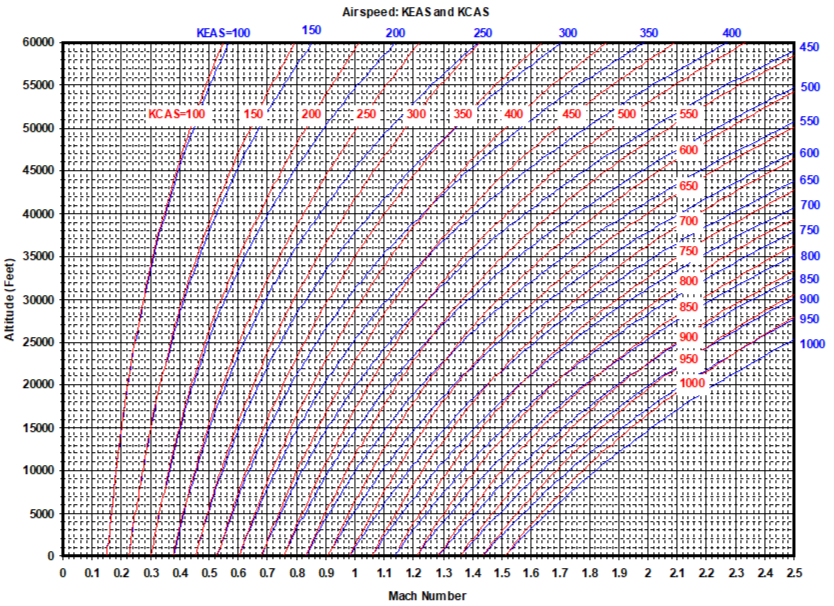

# 0. Introduction

## 0.1 Situation: You Need a Mach/Altitude Chart

:::::::::::::: {.columns}
::: {.column}
What do you do?

- Recreate tools from scratch
- Import/scan pictures
- Recreate pictures with digital drawings
:::
::: {.column}

:::
::::::::::::::

## 0.2 What If Instead You Had...

- The highest quality VECTOR (zoomable) graphics
- Reproducible examples in multiple languages and formats
- Universally available content

# 1. What it was

## 1.1 Handbook History

:::::::::::::: {.columns}
::: {.column}
- A book...
- ...that fit in your hand (debatable...see CRC)
- Quick reference for common facts/figures
:::
::: {.column}

:::
::::::::::::::

## 1.2 SFTE Handbook

:::::::::::::: {.columns}
::: {.column}
- 2001: First edition
- 2013: Most recent major revision
- 2019: 2 Addenda

Source
- Microsoft Word®
- Microsoft Publisher®

Production
- PDF
- Hardcopy
:::
::: {.column}
Issues 

- Images of various format, resolution, and quality
- Maintenance
    - Life cycle costs
    - Closed v open architecture
- No clear procedure for amendments and revisions
:::
::::::::::::::

# 2. What it is

## 2.1 "port"

`/pôrt/`

verb

verb: port; 3rd person present: ports; past tense: ported; past participle: ported; gerund or present participle: porting

**COMPUTING**

transfer (software) from one system or machine to another.

>"the software can be ported to an IBM RS/6000"

## 2.2 Porting the Handbook

:::::::::::::: {.columns}
::: {.column}

:::
::: {.column}
Source

- Unicode Text (Rmarkdown)

Production

- HTML
:::
::::::::::::::

## 2.3.1 GitHub Demo

:::::::::::::: {.columns}
::: {.column}
Required Tools 

- `git`
- `R`
- `bookdown`
- text editor
- command line
- web browser
- GitHub account

Optional Tools

- An Integrated Development Environment such as...
    - VS Code
    - RStudio
:::
::: {.column}

:::
::::::::::::::

## 2.3.2 GitHub concept map

# 3. What it shall be

## 3.1 Phases

Now: Complete HTML

Next: Complete PDF

Next^2^: 

- Code to...
    - generate every plot
    - implement every function
- Dynamic Handbook with...
    - interactive visualizations
    - interactive calculations

Next^3^: "Refactor" entirely → Handbook 2.0

> A means of organizing and making accessible FTE knowledge, practices, and standards

## Summary

There's a lot to know

Modern tools allow for

- more ready access
- engagement with knowledge
- reproducibility
- fine-grained version control

Things of value require **cultivation**

- growth environment
- weeding
- pruning
- support
- attention

## References

1. CRC Image By NE Ent - Own work, CC BY-SA 3.0, https://commons.wikimedia.org/w/index.php?curid=24352142
1. GitHub Logo, https://github.com/logos 